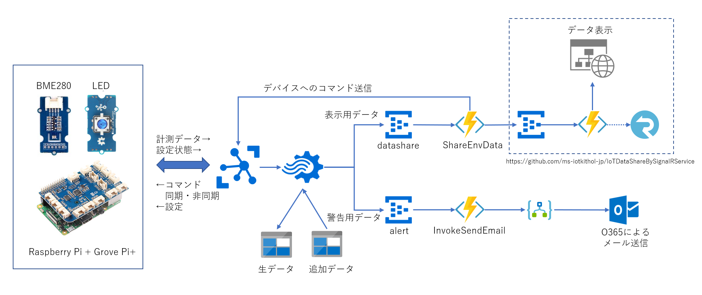

# 環境センシング IoT ハンズオン  
本コンテンツは、温度や湿度、大気圧など環境情報を収集するデバイスと、Microsoft が提供する各種サービス、技術を用いて、IoT ソリューションを構築するための基礎を、実機を使って、学ぶことを目的としている。  

本コンテンツを実習することによって得られるスキルは以下の通りある。  

- Azure IoT Device SDK を使って、Azure IoT Hub に接続
- Azure IoT Edge を使って、Azure IoT Hub に接続
- デバイスと Azure IoT Hub 間でのデータ送受信、管理機能 
- Azure IoT Hub で受信した時系列データの処理方法 
- 受信したデータの蓄積と、後段のサービスやアプリとの連携方法  
- Azure IoT Central を使った、IoT ソリューションの構築方法 

実装するシナリオは以下の通りである。  

- デバイスでの、温度、湿度、大気圧のリアルタイム計測とクラウドへの送信 
- リモートからの、デバイスの制御 
- 収集した時系列データの蓄積と、データ変換、及び、条件抽出
- 加工データの、アプリやサービスへの転送とグラフ表示  
- 抽出した警告状態をメールで通知 

本コンテンツに従って、ステップバイステップでこれらのシナリオを実装していく事によって、前述のスキルの獲得を目指す。  
Microsoft Azure が提供する IoT 関連サービス・技術は多岐にわたっており、本コンテンツでの利用はごく一部に過ぎない。本コンテンツ実習後の実践に向け、参考になるオンラインドキュメントを多数リンクしているので、本コンテンツの記載内容だけでなく、それらのドキュメントを全て読み込むことを推奨する。加えて、本コンテンツに記載のないオンラインドキュメントを自ら探すスキルも是非獲得していただきたい。  

※ 注意： 本コンテンツは、2020年9月27日時点の情報を元に作成しています。このコンテンツで取り上げたサービスや技術は、日々、改良、改善が加えられているので、記載通りに動かない場合は、Microsoft Docs のドキュメントを確認し、柔軟に実習してください。Contribution も大歓迎です。

----
## 実習内容  
実習で作成する、システムの構成図を図示する。  

実習は、以下のステップで行う。  

1. [デバイスのセットアップ](docs/SetupDevice.md)
2. [IoT Hub の作成](docs/IoTHub.md)
3. [Azure IoT Device SDK を使ったデバイスの接続](docs/IoTDeviceApp.md)
4. [Azure IoT Edge を使ったデバイスの接続](docs/IoTEdgeModule.md)
5. [Azure IoT Hub で受信したデータをリアルタイム処理する](docs/StreamAnalytics.md)
6. [環境データの共有](docs/DataShare.md)
7. [警告メールを送信する](docs/SendMail.md)
8. [Azure IoT Central によるデバイス接続](docs/IoTCentral.md)

Let's enjoy!

---
## 必要機材  

### 環境センシングデバイス  
- Raspberry Pi 3 または 4 
- [Groove Pi+](https://jp.seeedstudio.com/GrovePi-p-2241.html) 
- [Grove BME280 環境センサー](https://jp.seeedstudio.com/Grove-Temp-Humi-Barometer-Sensor-BME280-p-495.html)
- [Grove Blue LED Button](https://www.seeedstudio.com/Grove-Blue-LED-Button.html)  

### 開発用 PC と使用するツール 
- Windows 10 PC を推奨
- VS Code
- Putty
- Web ブラウザ  

### サービス契約  
- Azure Subscription  ※[無料お試しでも可](https://azure.microsoft.com/ja-jp/free)
- Office 365 ※ 警告メール送信のステップのみで使用  

### 実習時のネットワーク環境  
- 開発用 PC と Raspberry Pi を同一ネットワークにつなぐこと 
- 使用するネットワークは、接続デバイス間で、SSH 接続が可能な設定であること
---
