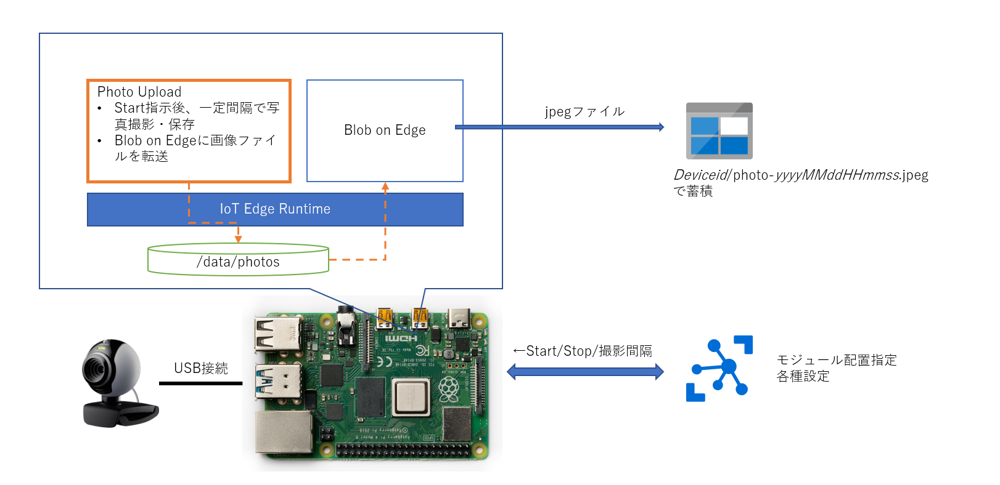

# 画像撮影、クラウドへのアップロード 
Raspberry Pi に USB Webcam を接続し、指示に従って画像を撮影、保存し、指定されたAzure Blob Storage にアップロードする。 



PhotoUploadモジュール（[main.py](./main.py)ロジックを使用)を使って、Webcam で画像を撮影し、
- photo-<i>yyyyMMddHHmmss</i>.jpeg

という名前の形式で一旦ホスト側のストレージに保存し、Blob on Edge に画像ファイルのアプロードを指示する。  
※ [main.py](./main.py)、[Dockerfile.arm32v7](./Dockerfile.arm32v7)、及び、[requirements.txt](./requirements.txt) は、Python、OpenCV を使って画像の撮影・保存を Raspberry Pi（Raspbian:Buster）de
行う IoT Edge Module（Docker Image）を作るためのサンプルとしても利用可能

## Photo Upload モジュールの Build 
Raspberry Pi 3以上 のシェル上で以下を実行する。  
```
$ cd PhotoUpload
$ sudo docker build -t photoupload -f Dockerfile.arm32v7 .
$ sudo docker tag photoupload your-docker-hub/photoupload:x.y.z-arm32v7
$ sudo docker push your-docker-hub/photoupload:x.y.z-arm32v7
``` 
'<i>your-docker-hub</i>'の部分は、各自の Azure Container Registry のアドレスや、Docker Hub の名前を入力すること。  
'<i>x.y.z</i>' は、各自の流儀に従ってバージョン番号を付与すること。  
tag コマンドで作成した URL を Azure IoT Edge へのモジュール配置時に使用する。
※ 既に Build 済みのものを、[embeddedgeorge/photoupload:0.0.3-arm32v7](https://hub.docker.com/repository/docker/embeddedgeorge/photoupload) で公開しているので、そちらを使っても構わない。  

---
## BLob on Edge の配置  
Blob on Edge がアップロードする先の Azure 上の Blob Storage をまず作成する。「[クイックスタート:Azure porta を使用して BLOB をアップロード、ダウンロード、及び一覧表示する](https://docs.microsoft.com/ja-jp/azure/storage/blobs/storage-quickstart-blobs-portal)」を参照して、Azure Storage Account を作成し、画像をクラウド側で保持するための Blob Container を '<b>photo-store</b>' という名前で作成する。  


Blob on Edge はマイクロソフトが提供する基本モジュールであり、[Azure Marketplace](https://azuremarketplace.microsoft.com/ja-jp/marketplace/apps/azure-blob-storage.edge-azure-blob-storage?tab=Overview) から公開されている。  
IoT Edge デバイスへの配置は、
- 「[IoT Edge 上の Azure Blob Storage を使用してエッジにデータを格納する](https://docs.microsoft.com/ja-jp/azure/iot-edge/how-to-store-data-blob?view=iotedge-2018-06)」
- 「[IoT Edge モジュール上の Azure Blob Storage を自分のデバイスにデプロイする](https://docs.microsoft.com/ja-jp/azure/iot-edge/how-to-deploy-blob?view=iotedge-2018-06)」

を熟読して行うこと。/srv/container の作成・設定等は、Linuxに関する記述についてもれなく行うこと。チュートリアルに記載の手順に従った場合の Azure Portal 上での設定を参考までにいかに示す。  

|Setting Name|Setting Value|
|----|----|
|Module Identity Name|AzureBlobStorageonIoTEdge|
|Image URI|mcr.microsoft.com/azure-blob-storage:latest|

### Container Create Options 
```
{
  "HostConfig": {
    "Binds": [
      "/srv/containerdata:/blobroot",
      "/data/photos:/photos"
    ],
    "PortBindings": {
      "11002/tcp": [
        {
          "HostPort": "11002"
        }
      ]
    }
  }
}
```
チュートリアルに記載の設定に加えて、<b>Binds</b> に  Photo Upload モジュールの画像ファイル格納場所（後述）の`<b>/data/photos</b>' を追加する。

### Environment Variables
|環境変数名|値|
|----|----|
|LOCAL_STORAGE_ACCOUNT_NAME|localaccount|
|LOCAL_STORAGE_ACCOUNT_KEY|rhCGXr1cII7EMvD2xrv7tA== ※例として|

実運用の場合は、'<b>LOCAL_STORAGE_ACCOUNT_KEY</b>' は、チュートリアルに記載の通り、[GeneratePlus](https://generate.plus/en/base64) 等を使って生成したBASE64エンコーディングされた文字列を各自用意すること。  

※ Blob on Edge は、Azure Storage Account が提供するアクセス方法と基本的に同じであり、Azure の場合に RBAC の SAS Tokenが必要なのと同じように、Blob on Edge
も、それぞれの配置されたモジュールごとに、アカウント名とアカウントキーが必要になり、このペアを知っている IoT Edge Modul が、Blob on Edge のサービスを利用可能

### Module Twin Settings  
```
{
  "deviceAutoDeleteProperties": {
    "deleteOn": true,
    "deleteAfterMinutes": 5,
    "retainWhileUploading": true
  },
  "deviceToCloudUploadProperties": {
    "uploadOn": true,
    "uploadOrder": "OldestFirst",
    "cloudStorageConnectionString": "<- your Azure Storage Accont connection string ->",
    "storageContainersForUpload": {
      "photos": {
        "target": "photo-store"
      }
    },
    "deleteAfterUpload": true
  }
}
```
以上で、配置の設定は完了である。  


---
## Photo Upload の配置  
「[Azure Portal から Azure IoT Edge モジュールをデプロイする](https://docs.microsoft.com/ja-jp/azure/iot-edge/how-to-deploy-modules-portal?view=iotedge-2018-06)]を熟読し、記載の方法を参考にしながら、PhotoUpload モジュールを Raspberry Pi に配置する。  
配置の設定は以下の通り。 
### Container Create Options 
```
{
  "HostConfig": {
    "Binds": [
      "/data/photos:/photos"
    ],
    "Privileged": true,
    "Devices": [
      {
        "PathOnHost": "/dev/video0",
        "PathInContainer": "/dev/video0",
        "CgroupPermissions": "mrw"
      }
    ]
  }
}
```
'/data/photos' は、予め Raspberry Pi で、root ユーザーが書き込めるディレクトリの作成と設定をしておくこと。  

### Environment Variables（環境変数）  
|環境変数名|値|
|----|----|
|BLOB_ON_EDGE_MODULE|Blob on Edge の配置時の名前 ※ 例として AzureBlobStorageonIoTEdge|
|BLOB_ON_EDGE_ACCOUNT_NAME|localaccount ※ 例として。前述の Blob on Edge で設定した名前と同じ|
|BLOB_ON_EDGE_ACCOUNT_KEY|rhCGXr1cII7EMvD2xrv7tA== ※ 例として。前述の Blob on Edgeへのアクセスキーと同じにする|
|PHOTO_CONTAINER_NAME|photos ※ Blob on Edge 側のコンテナ名|
|PHOTO_DATA_FOLDER|Container Create Options で指定した画像ファイルの保存場所 ※このケースでは、'<b>/photos</b>'|

※ ちょっと煩雑ではあるが、Blob on Edge 側の設定とこちら側の設定の同じ項目の値を間違えないこと。  
※ Blob on Edge もまたセキュアなサービスであることを認識して、仕組みを頭に思い浮かべながら、各設定をしていっていただきたい。

### Module Twin Settings  
Photo Upload モジュールの画像撮影は、デフォルトで、10秒間隔で行うように作られている。この時間間隔を変えたい場合は、配置の設定時に
```
{
    "upload_cycle_sec": 20
}
```
のように間隔を秒で指定するか、配置時には設定せずに、配置後のModule Twinsで、
```
  "properties": {
    "desired": {
        "upload_cycle_sec":20
 ```
 の様に Desired Properties を更新することにより、アップロード間隔を変えることができる。

Photo Upload モジュールは、画像撮影・保存して、Blob on Edge への転送を行った後、保存した画像を削除する。

### Direct Method による、撮影・保存・アップロードの制御  
Photo Upload モジュールは、外部から明示的に開始を指示を受けて、画像の撮影・保存・アップロードを開始する。一旦処理を開始した後は、外部からの停止要求がくるまで、撮影とアップロードを続ける。  
|Direct Method Name|Payload|意味|
|----|----|----|
|Start|無し|撮影・アップロード開始|
|Stop|無し|撮影・アップロード停止|
