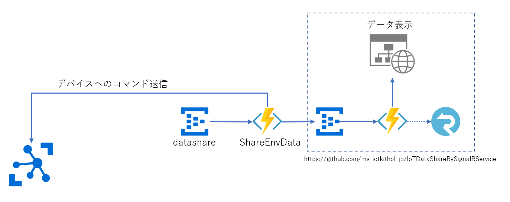
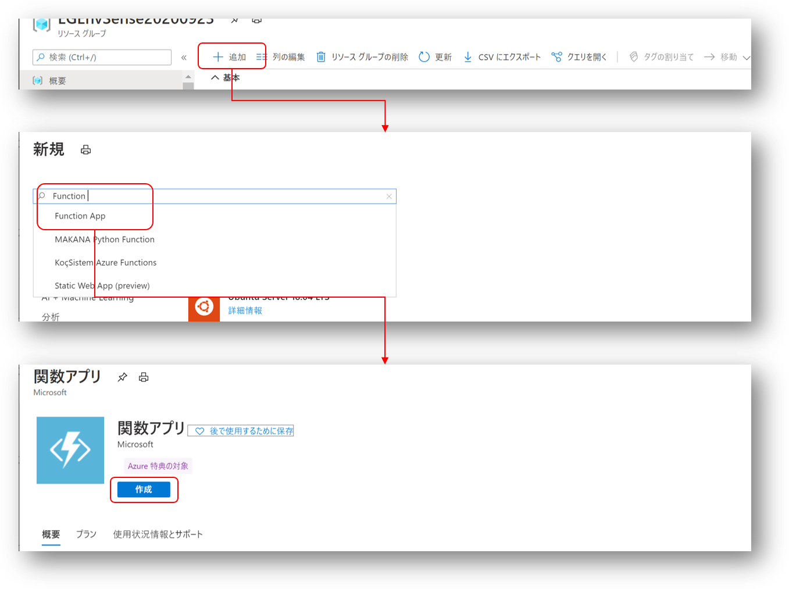
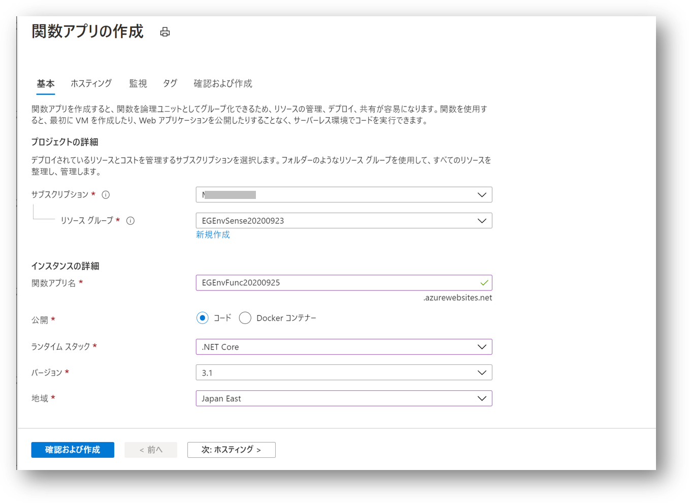
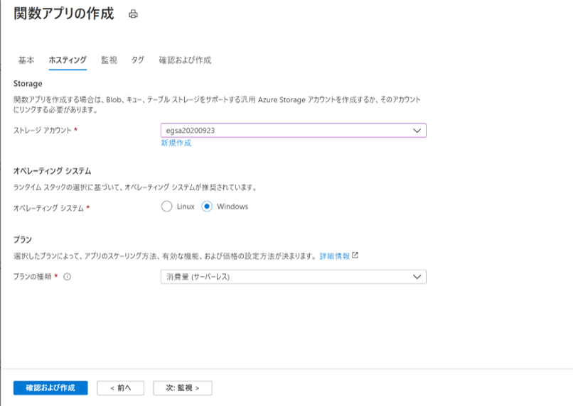
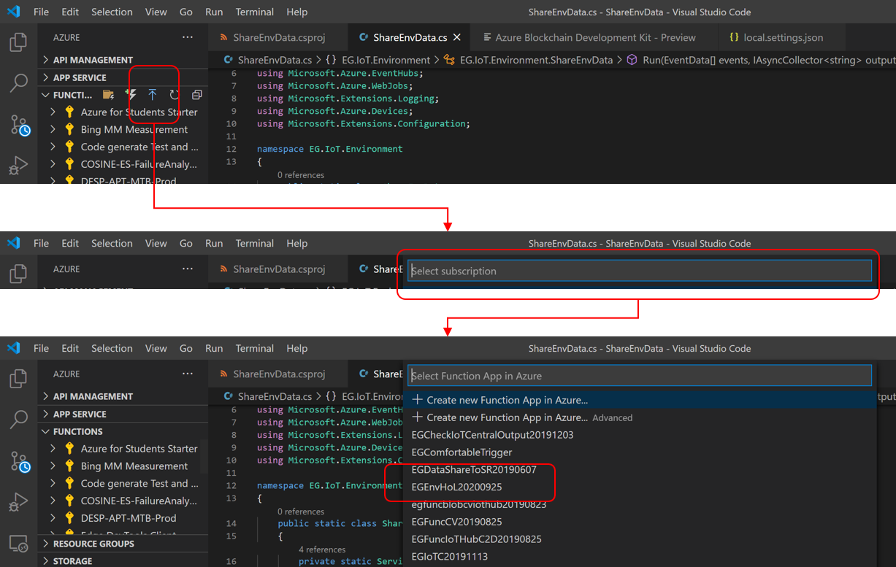
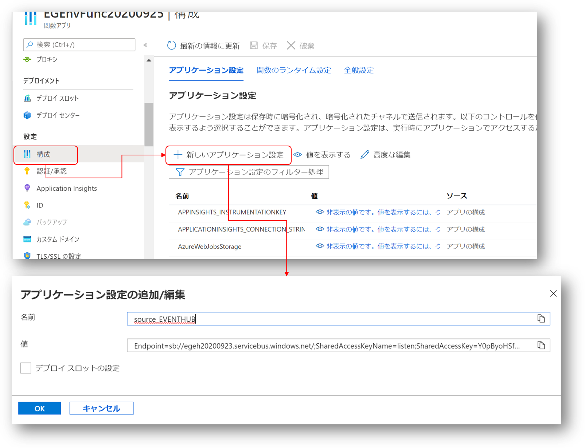
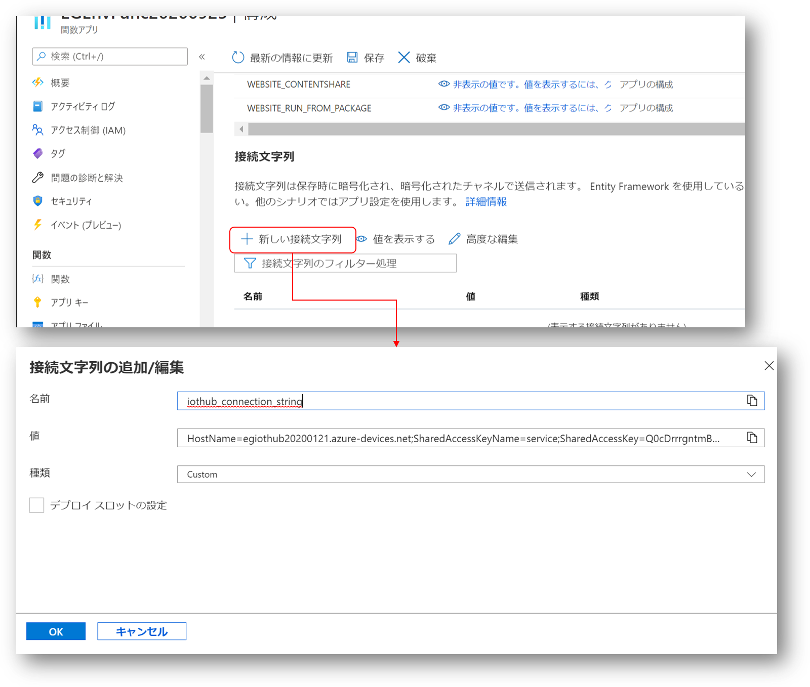
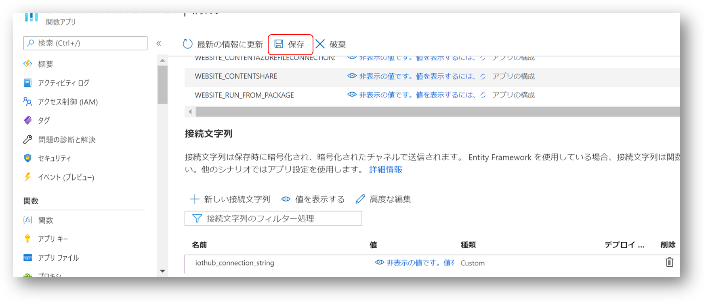

# 環境データの共有  
Stream Analytics で処理したデータを他の複数のサービスに共有する方法を実習する。 
Event Hub の <b>datashare</b> で受信したデータを、SignalR サービスを使って、そのデータに関心のあるサービスやアプリに配信する。 
追加で、不快指数が閾値以上のデータを送信してきたデバイスに対してコマンドを送信する処理も併せて実習する。  

尚、点線で囲まれた部分は、[IoTDataShareBySignalRService
](https://github.com/ms-iotkithol-jp/IoTDataShareBySignalRService
) という、別のリポジトリで公開しているコンテンツを流用する。  
本実習を行う前に、まずこのリポジトリを元に、SignalR サービスによるデータ共有サービスを構築しておくこと。  

---
## Azure Functions によるデータ転送と、デバイスへのコマンド送信  
<b>datashare</b> で受信したデータを、SignalR サービスへのデータ送信の窓口である、Event Hub に送信するロジックを、Azure Functions を使って実装する。  
本実習には、以下の環境が必要なので、以下のドキュメントを参照して環境を整えること。  
- [VS Code](https://code.visualstudio.com/)
- [VS Code C# 拡張](https://marketplace.visualstudio.com/items?itemName=ms-dotnettools.csharp)
- [VS Code Azure Function](https://marketplace.visualstudio.com/items?itemName=ms-azuretools.vscode-azurefunctions)  

VS Code による、Azure Functions 構築の基本は、「[クイック スタート:Visual Studio Code を使用して Azure で関数を作成する](https://docs.microsoft.com/ja-jp/azure/azure-functions/functions-create-first-function-vs-code?pivots=programming-language-csharp)」を参照するとよい。実習で使用するロジック一式も、このドキュメントを元に作成したものを改変している。  

環境が整ったら、以下の手順で実習を進める。  
1. [Function ロジックへの接続情報追加](#1-Function-ロジックへの接続情報追加)
2. [SignalR による転送の確認](#2-SignalR-による転送の確認)
3. [デバイスへのコマンド送信の確認](#3-デバイスへのコマンド送信の確認)
4. [Azure へのデプロイ](#4-Azure-へのデプロイ)

---

### 1. Function ロジックへの接続情報追加    
VS Codeで、[services/ShareEnvData](../services/ShareEnvData)を開く。 
このプロジェクトは、Event Hub や Azure IoT Hub への接続情報を設定すれば動作可能になっている。  
まず、[local.settings.json](../services/ShareEnvData/local.settings.json) を開き
```json
{
  "IsEncrypted": false,
  "Values": {
    "AzureWebJobsStorage": "<- your storage accont connection string ->",
    "FUNCTIONS_WORKER_RUNTIME": "dotnet",
    "source_EVENTHUB": "<- your event hub binded to Stream Analytics output ->",
    "destination_EVENTHUB":"<- your event hub binded to SignalR input ->"
  },
  "ConnectionStrings":{
    "iothub_connection_string":"<- your IoT Hub service role onnection string ->"
  }
}
```
それぞれ、<- ...- >の部分を対応する接続文字列で置き換える。  
- AzureWebJobStorage  
 Stream Analytics 作成時に作った Azure Storage Account の接続文字列
- source_EVENTHUB  
 Stream Analytics 作成時に作った Event Hub の <b>datashare</b> の listen ポリシーの接続文字列
- destination_EVENTHUB  
 SignalR への送信用の Event Hub の送信権限を持ったポリシーの接続文字列
- iothub_connection_string  
 作成した Azure IoT Hub の service ロールの接続文字列

 これらを置き換えて保存すれば準備完了である。  

 「[ローカルで実行する](https://docs.microsoft.com/ja-jp/azure/azure-functions/functions-create-first-function-vs-code?pivots=programming-language-csharp#run-the-function-locally)」に記載された方法に従って、Windows PC 上でローカル実行し、Azure IoT Hub に送られて Stream Analytics で処理されたデータを使って実行テストを行うこと。  

 Event Hub からのデータ受信、及び、別の Event Hub への転送は、
 ```C#
         [FunctionName("ShareEnvData")]
        public static async Task Run([EventHubTrigger("datashare", Connection = "source_EVENTHUB")] EventData[] events,
        [EventHub("datasource", Connection = "destination_EVENTHUB")]IAsyncCollector<string> outputEvents,
        ILogger log, ExecutionContext context)
        {
            var exceptions = new List<Exception>();
            
            // 途中省略

            foreach (EventData eventData in events)
            {
                try
                {
                    string messageBody = Encoding.UTF8.GetString(eventData.Body.Array, eventData.Body.Offset, eventData.Body.Count);
                    // Send to SignalR service event hub
                    dynamic envDataJson = Newtonsoft.Json.JsonConvert.DeserializeObject(messageBody);
                    if (envDataJson.GetType().Name == "JArray") {
                        dynamic envData = envDataJson[0];
                        string envDataMsg = Newtonsoft.Json.JsonConvert.SerializeObject(envData);
                        await outputEvents.AddAsync(envDataMsg);

```
Azure が提供するサービスとの連携は、Functions のバインディング機構を利用することで非常に簡単に実装可能である。Event Hub が受信したデータは、<b>events</b> という変数で渡され、別の Event Hub への書き込みは、引数で渡される、<b>outputEvents</b> のAddAsync メソッドをコールするだけで送信可能である。  

---
 ## 2. SignalR による転送の確認  
[services/SampleViewer/multideviceviewer.html](../services/SampleViewer/multideviceviewer.html) を使うと、SignalR が配信しているデータをグラフ化できるので、それを使って確認を行う。  
まず、[services/SampleViewer/scripts/multidevicedatabysignalr.js](../services/SampleViewer/scripts/multidevicedatabysignalr.js)  をエディターで開き、80行付近の、
```javascript
    const apiBaseUrl = "<- your SignalR Uri ->";
    let data = { ready: false };
    textArrivedElem = document.getElementById("textArrived");
    textMessageElem = document.getElementById("textMessage");

    getConnectionInfo().then(function (info) {
        let accessToken = info.accessToken;
```
<- Your SignalR Uri -> の部分を、各自が構築した SignalR サービスの URL で置き換え、保存する。 
[services/SampleViewer/multideviceviewer.html](../services/SampleViewer/multideviceviewer.html) を Chome 等の ウェブブラウザ―で開く。  
この HTML ファイルが開かれると、JavaScript のロジックが実行され、SignalR サービスにサブスクライブし、データ受信待ちとなる。<b>datashare</b> にデータが送信されるたびに、ShareEnvData のロジックが起動され、SignalR を経て、データが届き、温度、湿度、大気圧のグラフが、デバイスごとに表示される。  

---
## 3. デバイスへのコマンド送信の確認  
デバイスへのコマンド送信は、Raspberry Pi が送ってきた温度、湿度から不快指数を計算し、閾値を超えた場合に、送付元のデバイスに対して、LEDを点灯、閾値が戻ったときにLEDを消灯する。そのあたりのロジックを紹介しておく。  
```C#
    string deviceId = envData.deviceid;
    double temperature = envData.temperature;
    double humidity = envData.humidity;
    double discomfortIndex = 0.81 * temperature + 0.01 * humidity * (0.99 * temperature - 14.3) + 46.3;
    string alertCommand = null;
    lock(alertingDevices) {
        bool isAlerting = false;
        if (alertingDevices.Contains(deviceId)) {
            isAlerting = true;
        }

        if (discomfortIndex > 80.0) {
            if (!isAlerting) {
                alertingDevices.Add(deviceId);
                alertCommand = "on";
            }
        }
        else {
            if (isAlerting) {
                alertingDevices.Remove(deviceId);
                alertCommand = "off";
            }
        }
    }
    if (!string.IsNullOrEmpty(alertCommand)){
        var command = new {
            command =  new {
                alert = alertCommand
            }
        };
        var commandMsg = new Message(System.Text.Encoding.UTF8.GetBytes(Newtonsoft.Json.JsonConvert.SerializeObject(command)));
        await serviceClient.SendAsync(deviceId, commandMsg);
    }
```
デバイスへのコマンド送信の典型的なパターンである。デバイスへのメッセージ送信、Direct Method のコールは、ServiceClient という、Azure IoT Service SDK が提供するライブラリを使う。

※ この実習では、不快指数の計算と閾値との比較を Function のロジックで実行しているが、実運用のシステムでは、データメッセージ数が増えると、このロジックの実行に関するスケーラビリティや実行コストが問題になる場合があるので、Stream Analytics での実行を推奨する。  


---
## 4. Azure へのデプロイ  
ローカルでのテストが済んだら、クラウドへの発行を行う。  
まず、Azure ポータルで、Function App を作成する。リソースグループのページで、'＋追加'をクリックし、"Function App" で検索し、'作成'をクリックする。
  
必要なパラメータを入力していく。

'関数アプリ名'は適宜決めてよい。 

- ランタイムスタック  
.NET Core
- バージョン  
3.1
- 地域  
リソースグループのリージョン  

入力したら、'次：ホスティング'をクリック  

 
ストレージアカウントは、Stream Analytics 作成時に作った Storage Account を選択する。他の項目はデフォルトのままでよい。  

入力を終えたら、設定をそのままに、'次：…' をクリックし続け、左下のボタンが、'作成'になったら、それをクリックして作成完了。  

※ IoT ソリューションでの Function 利用の場合、テレメトリーデータが頻繁に送信されることに伴い、Function の起動が頻繁に発生するのがふつうである。この実習では、'プランの種類'を、'消費量（サーバーレス)'にしているが、大抵の場合は、App Service の利用を検討したほうが好ましい。  

Azure ポータル上での Function App 作成が完了したら、VS Code に戻って、ロジックのデプロイを実行する。  

VS Code の左のペインの Azure アイコンをクリックして Azure ビューを開き、FUNCTION の アップロードボタンをクリックし、サブスクリプションを選択して、前のステップで作成した Function App を選択する。  
ロジックのアップロードが開始され、完了するまで待つ。  

local.settings.json の接続に関するセキュリティ情報を、Azure 側にも設定する。  
Azure ポータルで、作成した Function App を開き、'構成'をクリックし、

- source_EVENTHUB
- destination_EVENTHUB

の二つの接続文字列を追加する。  
'iothub_connection_string' は、ConnectionStrings のパートに定義しているので、接続文字列として設定する。

種類は、'Custom' を選択。  
全てを設定し終えたら、忘れずに'保存'をクリックして反映させる。  


以上で、データシェア用、及び、デバイスへのコマンド送信サービスがクラウド上で稼働する。 正しく動いていることを確認すること。  

---
[次のステップへ進む](SendMail.md)