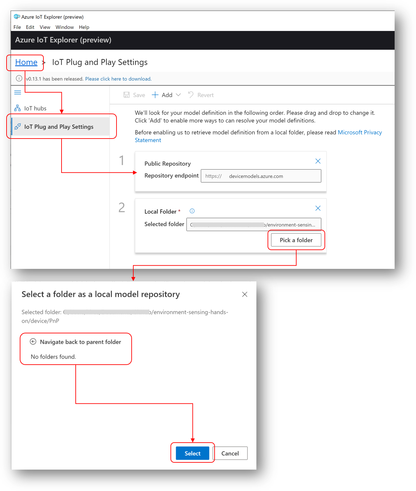
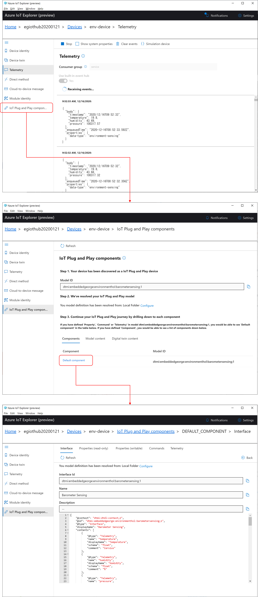
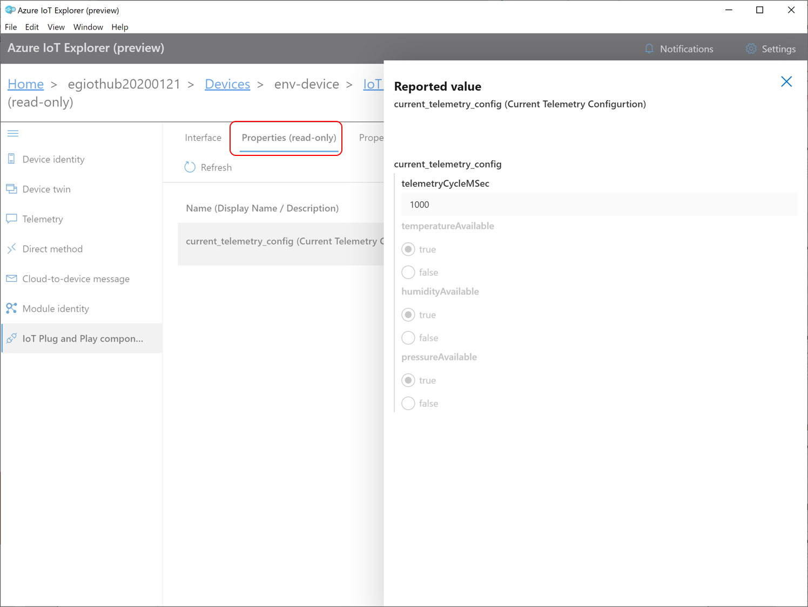
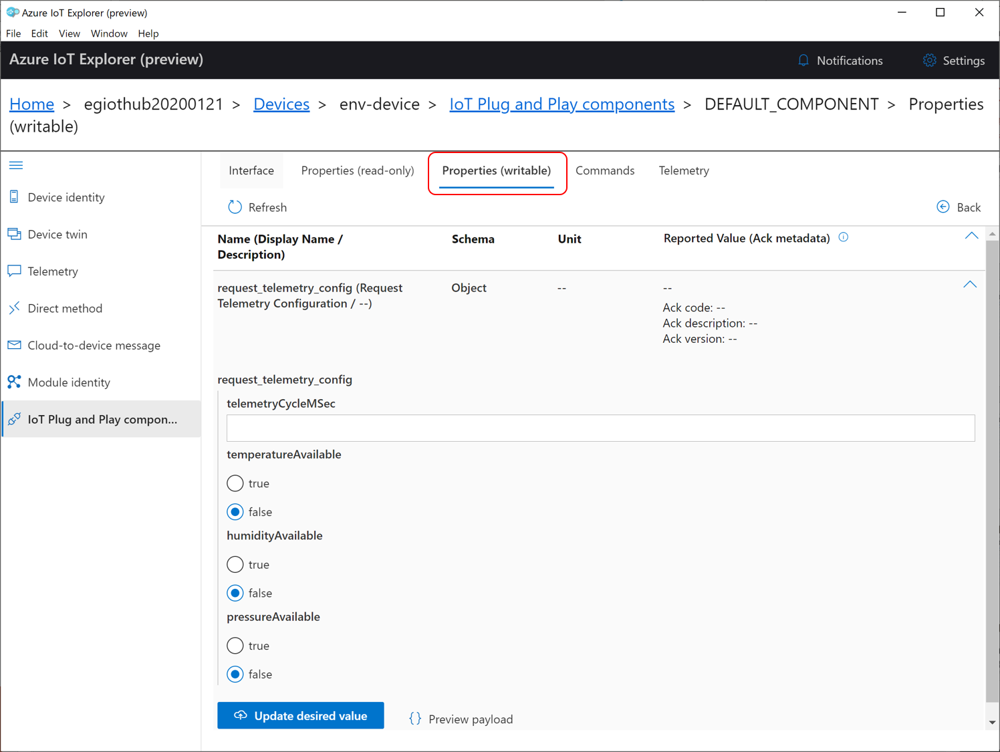
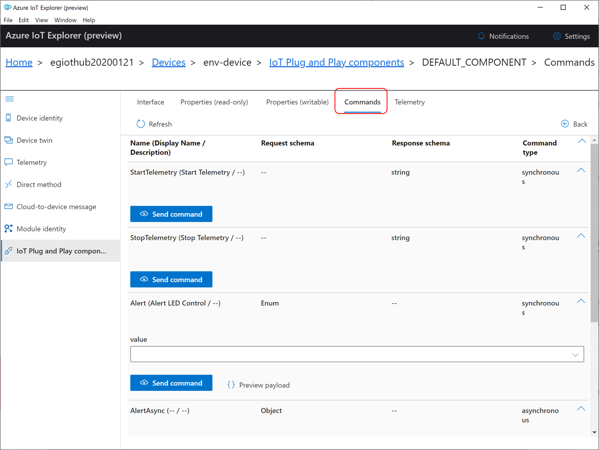
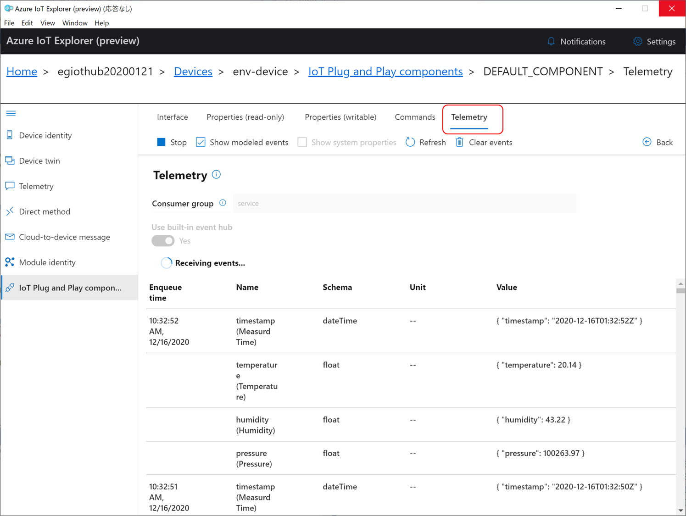

# IoT Plug & Play お試し  
「[IoT Plug & Play とは](https://docs.microsoft.com/ja-jp/azure/iot-pnp/overview-iot-plug-and-play)」に記載の機能を体感する。
「[Azure IoT Device SDK を使ったデバイスの接続](./IoTDeviceApp.md)」で試した Azure IoT Device を使った IoT アプリケーションの D2C、C2D、Device Twins、Direct Method のモデル定義を使って、IoT Hub に接続されたサービス側で、このアプリがどんなインターフェイスを持っているかを認識する。  
[DTDL V2](https://github.com/Azure/opendigitaltwins-dtdl/blob/master/DTDL/v2/dtdlv2.md) で定義したモデルは、[device/PnP/barometersensing.json](../device/PnP/barometersensing.json) である。  
このステップでは、[Azure IoT Explorer](https://docs.microsoft.com/ja-jp/azure/iot-pnp/howto-use-iot-explorer) で機能を試す。
## IoT Plug & Play モデルの登録 
Azure IoT Explorer を起動し、以下の図に従ってモデルを定義する。  

## IoTAppDevSDK アプリの送受信を IoT Plug and Play で解釈する。  
接続している Azure IoT Hub からデバイスを選択する。  
以下の図に従って、Plug and Play の機能を利用する。 

### Read Only Properties (Device Twins Reported Properties)

### Writable Properties (Device Twins Desired Properties)

### Command (Direct Methods or Cloud to Device Messages)

### Telemetry (Device To Cloud Messages)

---
## 参考  
[device/PnP/barometersensing.json](../device/PnP/barometersensing.json) と、[device/IoTAppDevSDK/EG/IoT/EnvironmentSensing/EnvironmentSensingDeviceClient.cs](../device/IoTAppDevSDK/EG/IoT/EnvironmentSensing/EnvironmentSensingDeviceClient.cs) を、よーく見比べて、IoT Plug and Play の DTDL V2 による記述方法を調べてみていただきたい。  
[device/PnP/barometersensing.json](../device/PnP/barometersensing.json) と、[device/setup/EnvironmentSensingDcm.json](../device/setup/EnvironmentSensingDcm.json) を見比べて、BarometerSensing の項目が同じ定義であることを確認していただきたい。  
