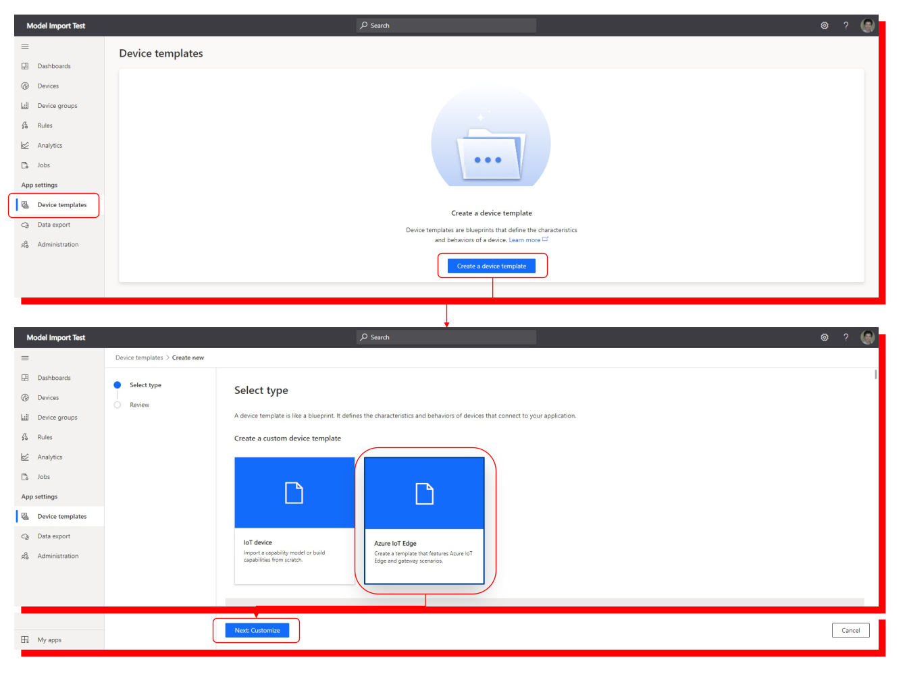

# モデル定義を使った、Azure IoT Central アプリケーションの作成  
2021/6/21 現在の IoT Central のアプリケーション作成 GUI をベースに説明。  
※ 既に旧方式で作成した device template がある場合の更新方法は、このページの最後の説明を参照の事。  

IoT Central アプリケーションを作成したら、Device Template を Azure IoT Edge を選択して作成する。  
  

"Device template name" を適当な名前に変えて、[deployment.arm32v7-co2.json](../device/setup/deployment-co2.arm32v7.json) を deployment template としてアップロードする。  

インポートされたモジュールが一覧表示さえるので、"Create" をクリック
  

中途半端な形で Module の送受信モデルが自動生成されたりされなかったりするので、一旦 managementをすべて削除する。  
  
上の図は、Balometer Sensing モジュールの management を消す手順を示している。同様な手順で他のモジュールの management もすべて消す。  
すべて消した状態を下図に示す。  
  

全てのモジュールに、[devices/setup/iotcentral](../devices/setup/iotcentral)のファイル群で定義されたモデルをインポートする。  
Balometer Sensing モジュールの手順を以下に示す。Balometer Sensing を選択して、[BarometerSensing.dcm.json](../device/setup/iotcentral/BarometerSensing.dcm.json) をインポートする。  
  
その他のモジュールも以下の対応で、それぞれコンポーネントモデルをインポートする。  

|Module Name|Component Model File Name|
|-|-|
|Barometer Sensing|[BarometerSensing.dcm.json](../device/setup/iotcentral/BarometerSensing.dcm.json)|
|getipaddresspython|[getipaddresspython.dcm.json](../device/setup/iotcentral/getipaddresspython.dcm.json)|
|photoupload|[PhotoUpload.dcm.json](../device/setup/iotcentral/PhotoUpload.dcm.json)|
|AzureBlobStorageonIoTEdge|[AzureBlobStorageonIoTEdge.dcm.json](../device/setup/iotcentral/AzureBlobStorageonIoTEdge.dcm.json)|

以上、全てのモジュールに management が追加される。  
  

一通り設定が終わったので、上の "Publish" をクリックしてテンプレートを公開し、デバイスを登録する。  

---
## 前に定義した Device Template の更新  
2021/6/21 現在の IoT Central のモデル定義 GUI より以前のもので定義済みの Device Template が既にある場合は、以下の手順で CO2 センサーを含む機能を利用できる。  
1. device template を表示  
1. 左上の "Version" をクリックして新しいバージョン作成  
1. deployment template を新しいものに置き換える  
1. Balometer Sensing の management を選択して、"Edit DTDL" をクリックし新しい定義に書き換える。  
1. "Publish" をクリックして、新しくデバイスを登録  
1. 新しいデバイスの接続情報を、Raspberry Pi 側の /etc/iotedge/config.yaml に設定
1. IoT Edge Runtime を再起動  
