# Azure IoT Central によるデバイス接続 
SaaS（Software As A Service) 型の [Azure IoT Central](https://docs.microsoft.com/ja-jp/azure/iot-central/core/overview-iot-central) を使って、デバイスをクラウドに接続する実習を行う。Azure IoT Device SDK を使った IoT アプリと、Docker ベースの Azure IoT Edge デバイスの両方が接続可能であるが、この実習では、Azure IoT Edge デバイスの接続を学ぶ。  

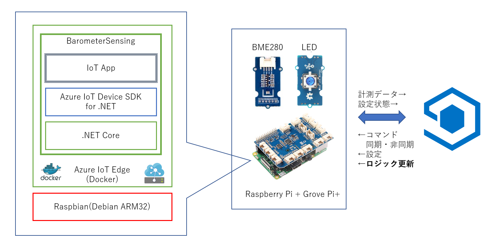 


Azure IoT Central は、Azure IoT Hub、[DPS（Device Provisioning Service）](https://docs.microsoft.com/ja-jp/azure/iot-dps/about-iot-dps)、Power BI、Azure Functions 等を使って構築されたサービスである。  
実習は以下のステップで行う。  

1. [IoT Central アプリケーションの作成](#1-iot-central-アプリケーションの作成) 
2. [デバイステンプレートの作成](#2-デバイステンプレートの作成)
3. [IoT Edge デバイスの登録](#3-iot-edge-デバイスの登録) 
4. [IoT Central アプリケーションのユーザー管理](#4-iot-central-アプリケーションのユーザー管理)
5. [IoT Central アプリケーションのカスタマイズ](#5-iot-central-アプリのカスタマイズ)  

---
## 1. IoT Central アプリケーションの作成 
まず、Web ブラウザで、以下の URL を開く。  
- [https://aka.ms/iotcentral](https://aka.ms/iotcentral)

左のペインの 'Build' を選択し、'Custmo apps' を選択して作業を進める。  

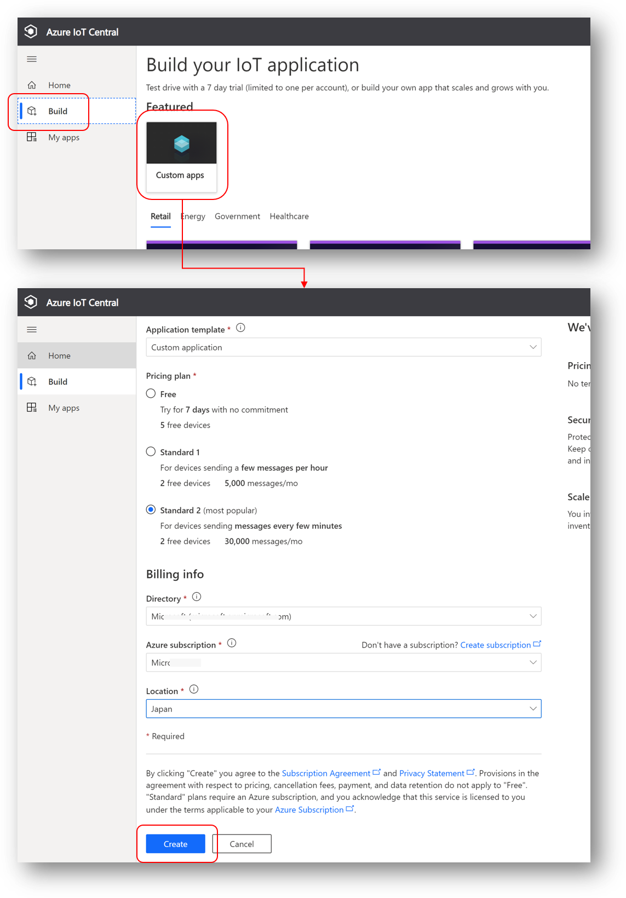
項目の設定は、  
- 'Application template'  
デフォルトのままで可
- 'Pricing Plan'  
'Standard 2'  
- 'Billing info'  
'Azure subscription'の情報を利用
- Location  
'Japan'

入力が終わったら、'Create' をクリックして、アプリが生成される。

---
## 2. デバイステンプレートの作成  
次に、接続する IoT Edge デバイスのテレメトリーデータ、デバイスツイン、等の情報を元に、テンプレートを作成する。  
前のステップの官僚時点のページで、'Device template' をクリックする。  

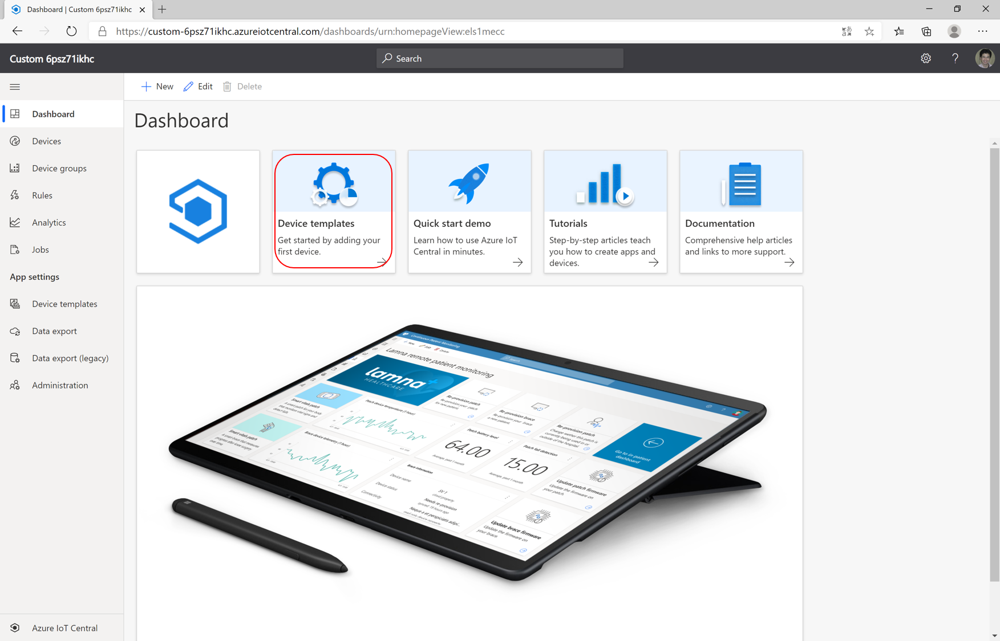

'+ New' をクリックし、'Azure IoT Edge' を選択する。  

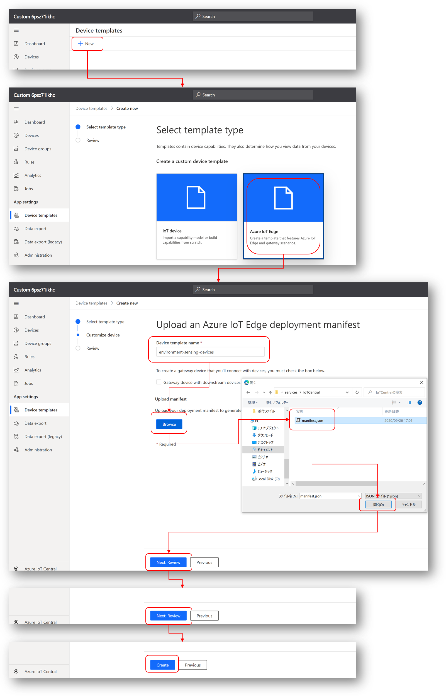  


### 配置マニフェストのインポート  
'Device template name' に、  
- <b>environment-sensing-device'  

と入力し、'Browse' をクリックして、[services/IoTCentral/manifest.json](../services/IoTCentral/manifest.json) を選択してアップロードする。そのあとは、'Next Review' をクリックし続け、'Create' をクリックしたら完了。  

※ <b>[services/IoTCentral/manifest.json](../services/IoTCentral/manifest.json)</b> は、Azure ポータルを使って、IoT Edge Module の配置を行った際に、最後に表示された JSON ファイルである。VS Code による開発の場合は、[device/EdgeSolution](device/EdgeSolution) で、'Build and Push IoT Edge Solution' を実行した際 [device/EdgeSolution/deployment.template.json](../device/EdgeSolution/deployment.template.json) を元にして、config フォルダーに生成される。  

### インターフェイスの定義  
IoT Edge デバイスから送信されてくるテレメトリーデータを定義する。  
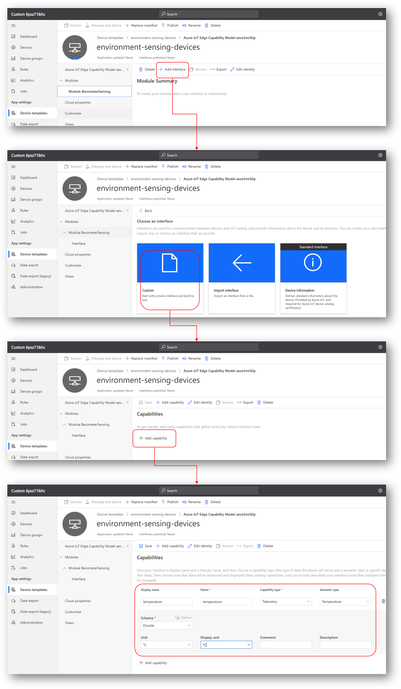  

'+ Add interface' → 'Custom' と選択し、'+ Add capability' で、IoT Edge デバイスから JSON フォーマットで送られてくる各項目を追加していく。図の最後は、<b>temperature</b> の設定部分である。以下を参考に全てのプロパティを追加する。  

|property|Capability type|Semantic type|Schema|
|---|---|---|---|
|temperature|Telemetry|Temperature|Double|
|humidity|Telemetry|Humidity|Double|
|pressure|Telemetry|Pressure|Double|
|timestamp|Telemetry||DateTime|

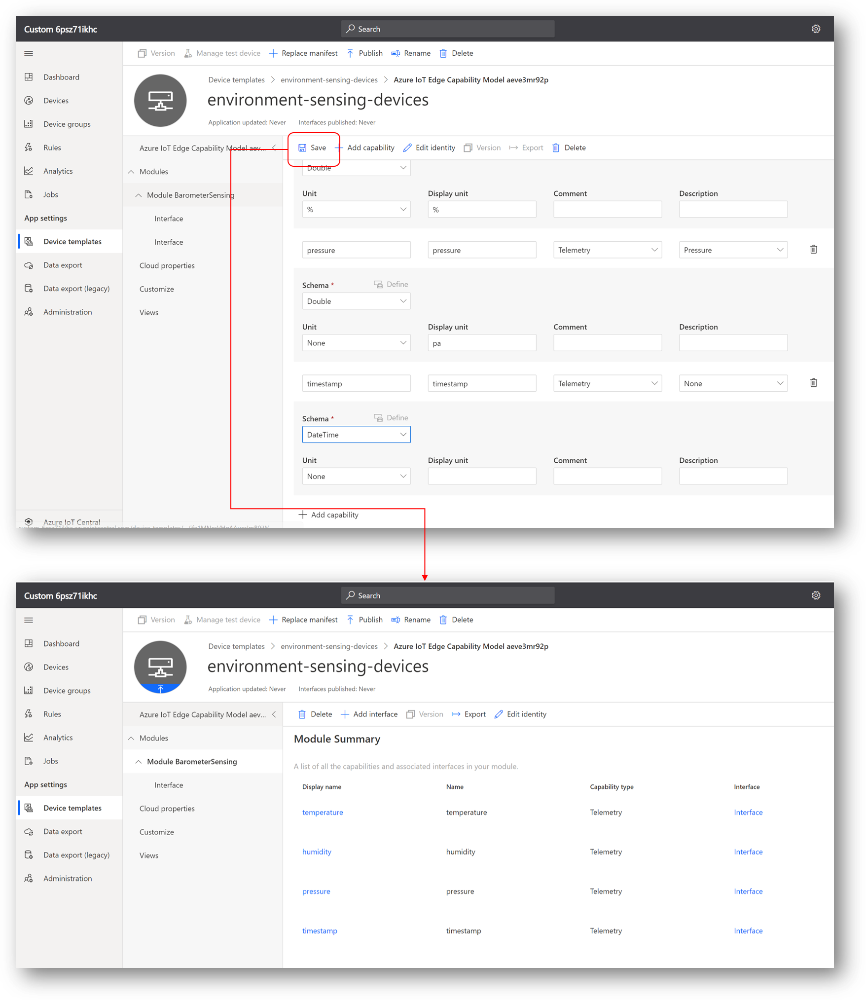
全て入力し終わったら、'Save' をクリックして保存する。  

### ビューの定義  
テレメトリーデータを表示するグラフのテンプレートを作成する。'View' を選択し、'Visualizing the device' を選択する。    
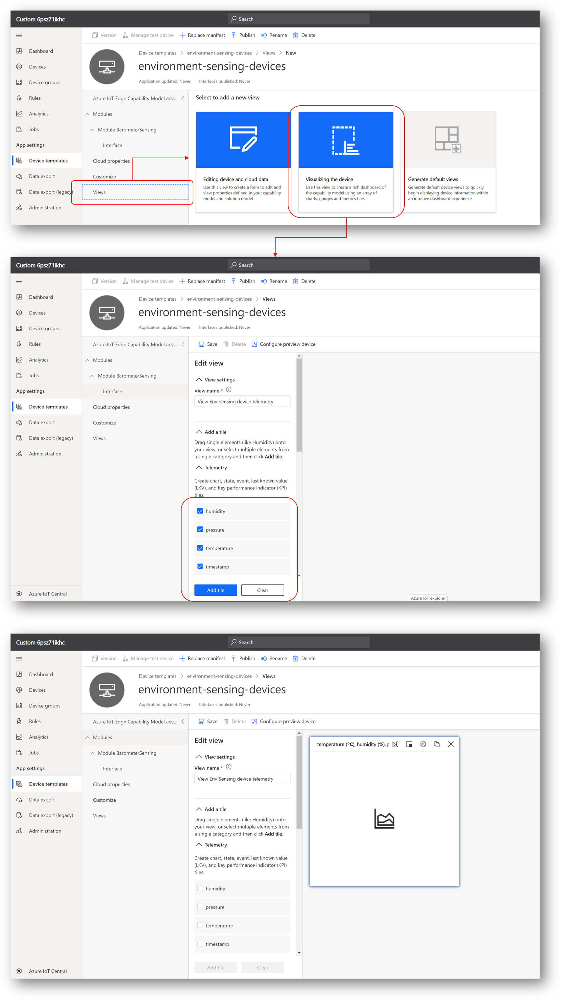  
前のステップで入力した、テレメトリーデータの項目が表示されるので、全てにチェックを入れて、'Add tile' をクリックしてビューの定義を完了する。  

### デバイステンプレートの公開  
作成したデバイステンプレートが使えるように、'Publish' する。  
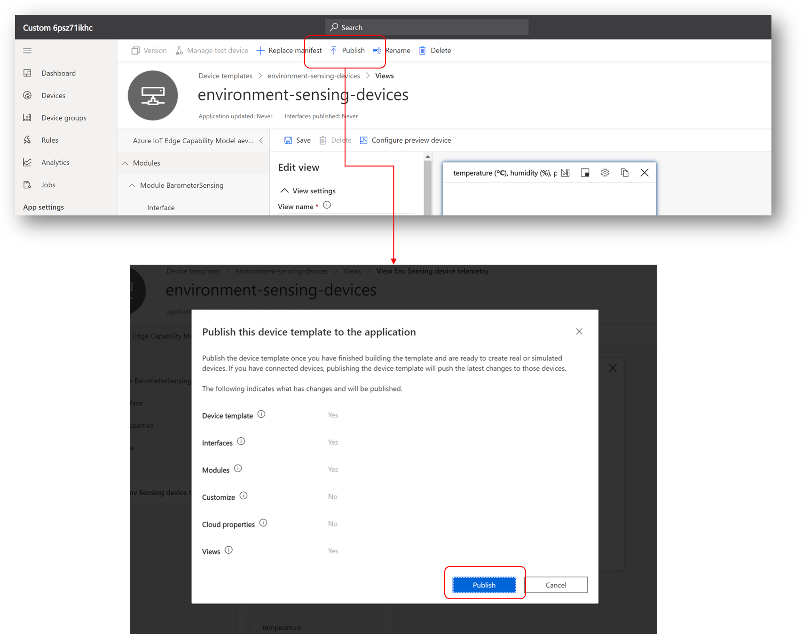

---
## 3. IoT Edge デバイスの登録  
出来上がったテンプレートで、Raspberry Pi + Grove Pi+ 上で動いている IoT Edge を、IoT Central アプリケーションに接続する。  
左のペインで、'Devices' を選択し、'+ New' をクリックし、表示されたダイアログで、作成 ＆ Publish した、デバイステンプレートを選択する。  

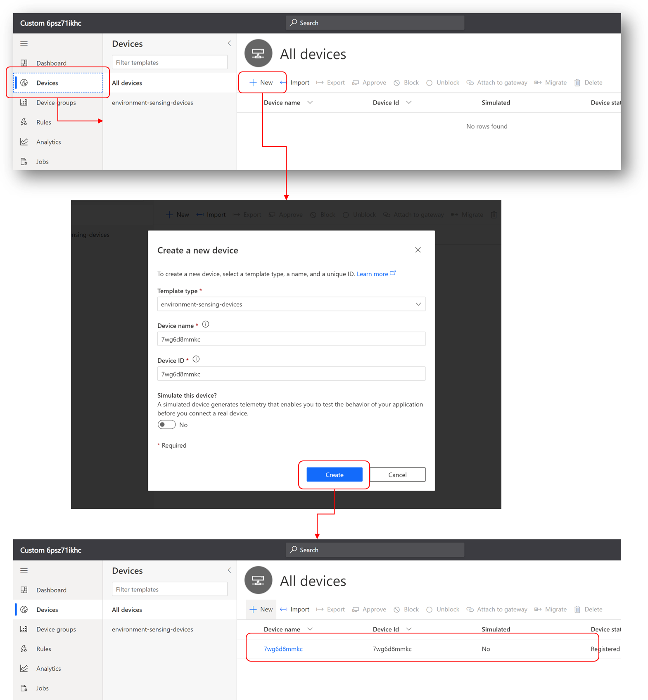

'Device Name'、'Device ID' はそのまま使っても、変えてもよい。'Create' で IoT Edge デバイスの登録が完了する。  

### Raspberry Pi 側の接続情報変更  
Raspberry Pi 上で動いている、IoT Edge Runtime の接続情報を、前のステップで登録したデバイスのセキュリティ情報で書き換えて、接続先を変える。  
まず、IoT Central のポータルで、前のステップで登録したデバイスの接続情報を取得する。  
登録したデバイスを選択し、右上の、'Connect'をクリックする。
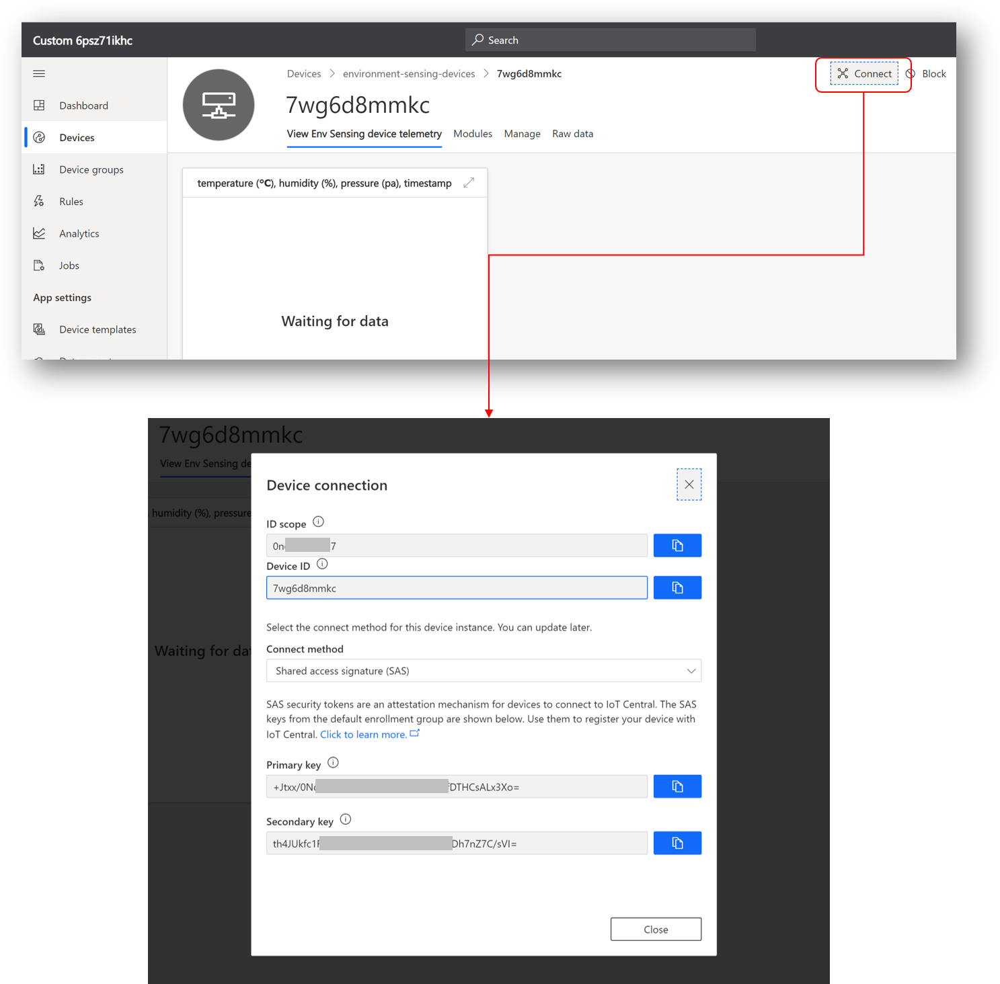   
冒頭で紹介した通り、IoT Central は、DPS を使った接続を行う。  

Raspberry Pi の Shell 上で、/etc/iotedge/config.xml をこの情報を元に更新する。  
まず、Azure IoT Hub への接続情報をコメントアウトする。  
- 編集前
```yaml
# Manual provisioning configuration
provisioning:
  source: "manual"
  device_connection_string: "HostName=..."
```
- 編集後
```yaml
# Manual provisioning configuration
# provisioning:
#  source: "manual"
#  device_connection_string: "HostName=..."
```
IoT Central の接続情報を設定する。コメントアウトされた以下のパートを探して、'#'を削除し、ダイアログに表示された情報をコピーする。
```yaml
# DPS symmetric key provisioning configuration
provisioning:
  source: "dps"
  global_endpoint: "https://global.azure-devices-provisioning.net"
  scope_id: "ID scopeをコピー"
  attestation:
    method: "symmetric_key"
    registration_id: "Device IDをコピー"
    symmetric_key: "Primary keyをコピー"
```
編集が終わったら、IoT Edge Runtime をリスタートする。  
```
$ sudo systemctl restart iotedge
```
IoT Edge Runtime はリスタート後、新しい接続情報を元に、IoT Centaral アプリケーションに接続し、テレメトリーデータの送信を開始する。IoT Central アプリケーションは、受信データをグラフ表示する。
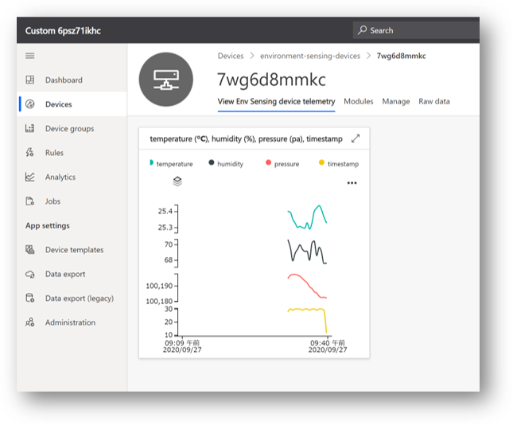

---
## 4. IoT Central アプリケーションのユーザー管理  
ホビーレベルの IoT とは異なり、ビジネスでのIoT利用では、作成した IoT アプリケーションが、適切な権限を持ったユーザーのみが閲覧、管理が可能でなければならない。  

### 実習
「[IoT Central アプリケーションでユーザーとロールを管理する](https://docs.microsoft.com/ja-jp/azure/iot-central/core/howto-manage-users-roles)」を参考にして、ユーザーを登録し、そのユーザーが適切な権限で、作成した IoT Central アプリにアクセスできることを確認すること。  


---
## 5. IoT Central アプリのカスタマイズ  
IoT Central は、Azure IoT Device SDK を使った IoT アプリや、IoT Edge の場合と同様、デバイスツインによる設定変更や、Direct Methodコールなども可能である。また、テレメトリーデータが閾値を超えた時に別のサービスを起動したり、受信したデータのエクスポート等々のカスタマイズが可能である。  

### 実習
「[クイック スタート:Azure IoT Central でデバイスのルールとアクションを構成する](https://docs.microsoft.com/ja-jp/azure/iot-central/core/quick-configure-rules)」を参考にして、温度が30度を超えた時にメールする改造を加える。

---
以上で、実習は終了である。IoT Central は、Digital Twins 時代を見据えた、IoT Plug ＆ Play 機能への対応など、様々な機能を有しているので、様々な IoT シナリオを想定し、IoT Central による実装方法を考えて、実際に試していただきたい。  

---
[コンテンツ Top へ](../README.md)
