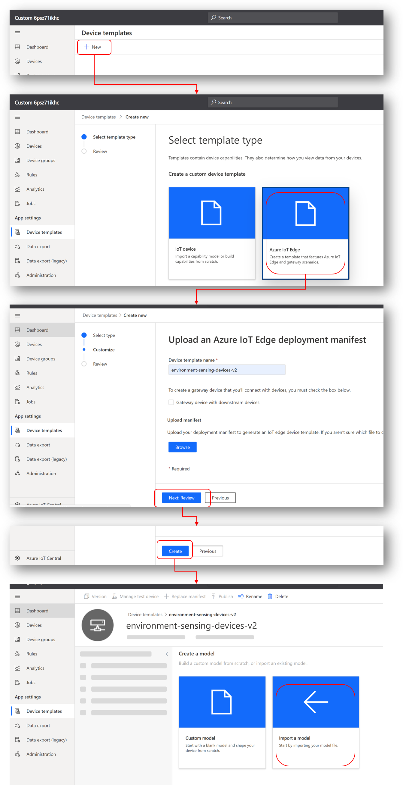
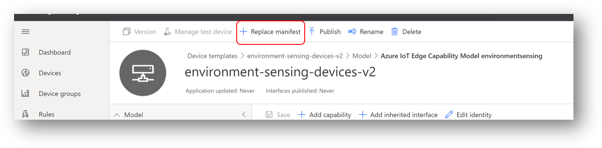
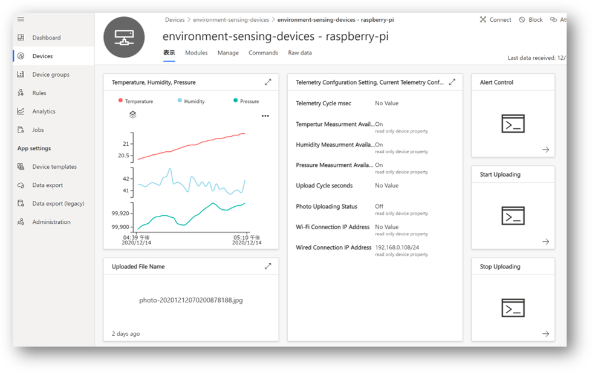

# モデル定義を使った、Azure IoT Central アプリケーションの作成  
このステップでは、DTDL を使って記述されたモデルを使って IoT Central アプリケーションを作成する。  
<b><u>※ 2021/6/21 現在、IoT Central の既存のモデル定義を使った device template 作成の GUI は更新されている。新しい GUI での作成方法は、[IoTCentral-20210621.md](./IoTCentral-20210621.md) を参照の事</u></b>   

IoT Central アプリケーションを作成する。（前のステップで作成したアプリケーションを使ってもよい。）  
Device Template を作成する。前のステップとは異なり、Deployment テンプレートは読み込まない。  

図の最後のステップで、[device/setup/EnvironmentSensingDcm.json](../device/setup/EnvironmentSensingDcm.json) をインポートする。  
※ EnvironmentSensingDcm.json は、DTDL V2 で記述した、Environment Sensing IoT Edge デバイスのモジュールの、D2C メッセージ、Module Twins、Direct Method を定義したファイルである。  

[deployment.arm32v7.json](../device/setup/deployment.arm32v7.json) の Azure IoT Edge Module の URI と Module Twins の設定を各自の環境に合わせて変更する。 
※ Azure IoT Edge の Image Uri は、動作確認済みの公開モジュールになっているので、そのまま使用してもよい。  

「＋Replace Manifest」をクリックして、設定完了した、deployment.arm32v7.json をアップロードする。

下図を参考に、View を定義する。　

View の定義が終わったら、Device Template を発行し、デバイスの接続を行う。  

---
## 備考  
前のステップでは、温度、湿度、大気圧、その他、様々な設定を一からする必要があったが、このステップでは、予め、Environment Sensing デバイスがどんなデータを送ってくるのか、Module Twins でどんな値を確認・更新できるのか、どんな Direct Method をコールできるのかを定義したモデルを読み込んでいるので、それらを定義する必要は無く、より少ない労力でアプリの構築が可能である。  
また、Module Twins の設定や、Direct Method コール用のページが自動で作成されるのも、便利である。