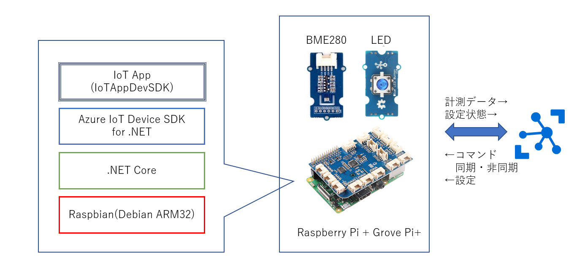
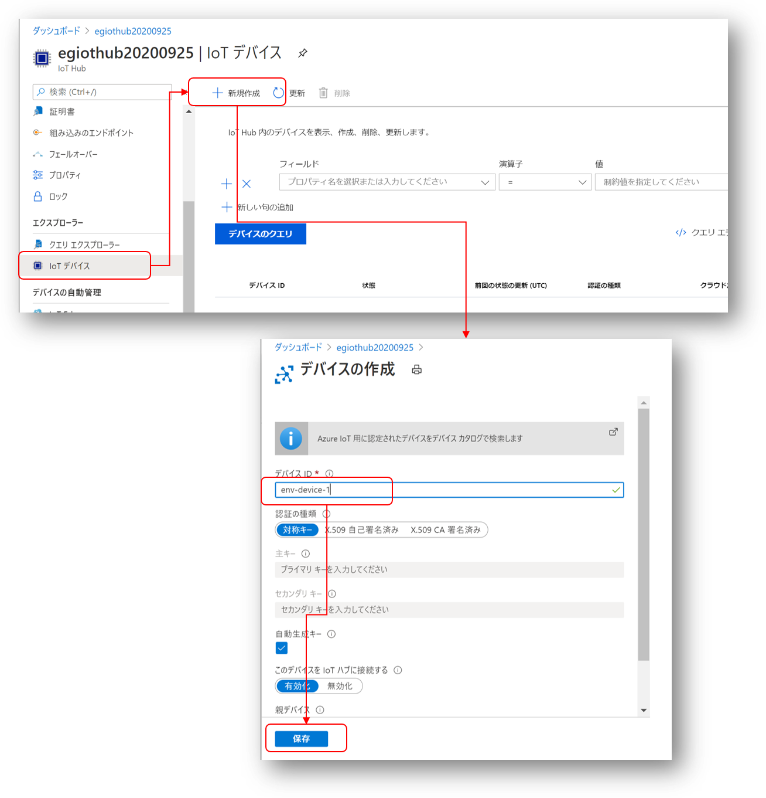
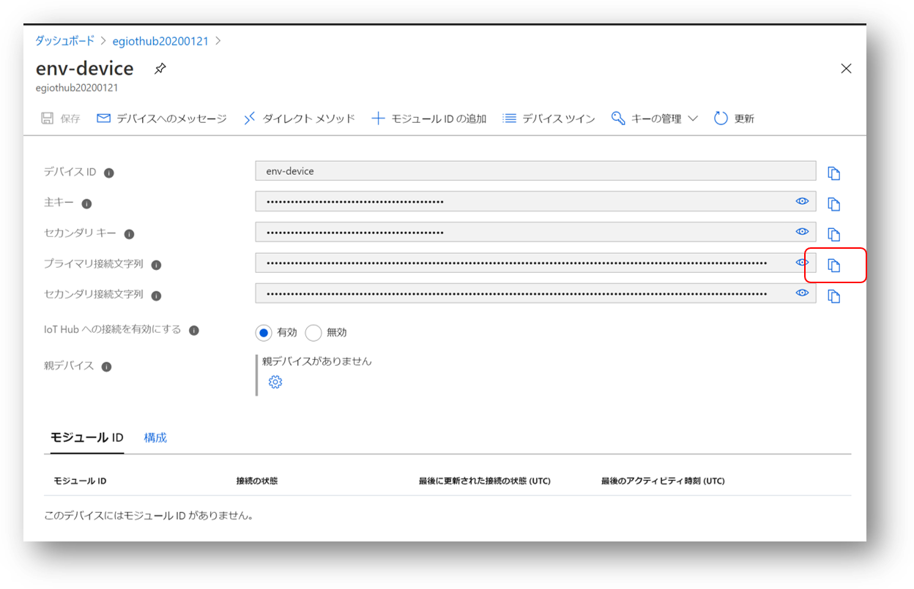
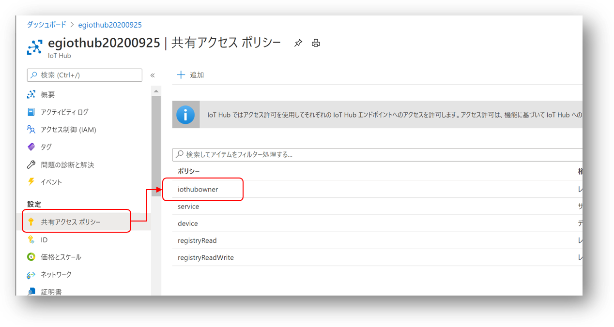
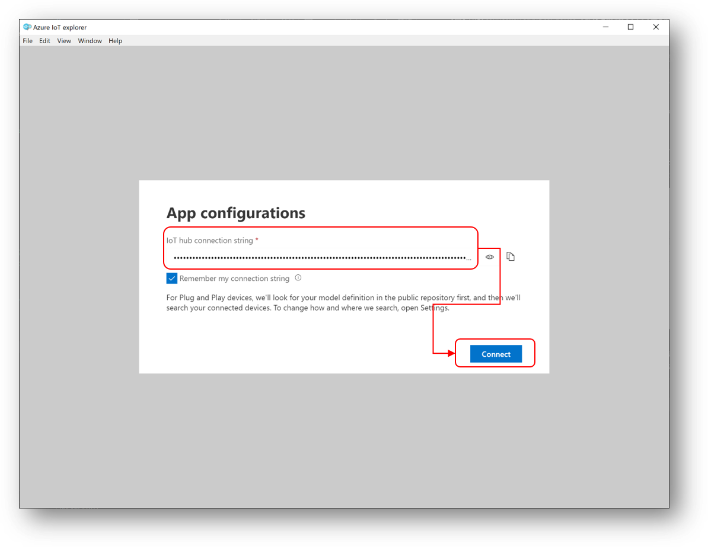
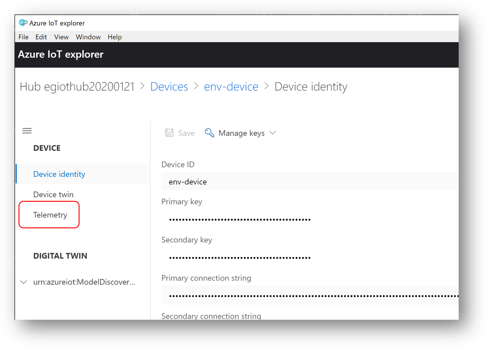
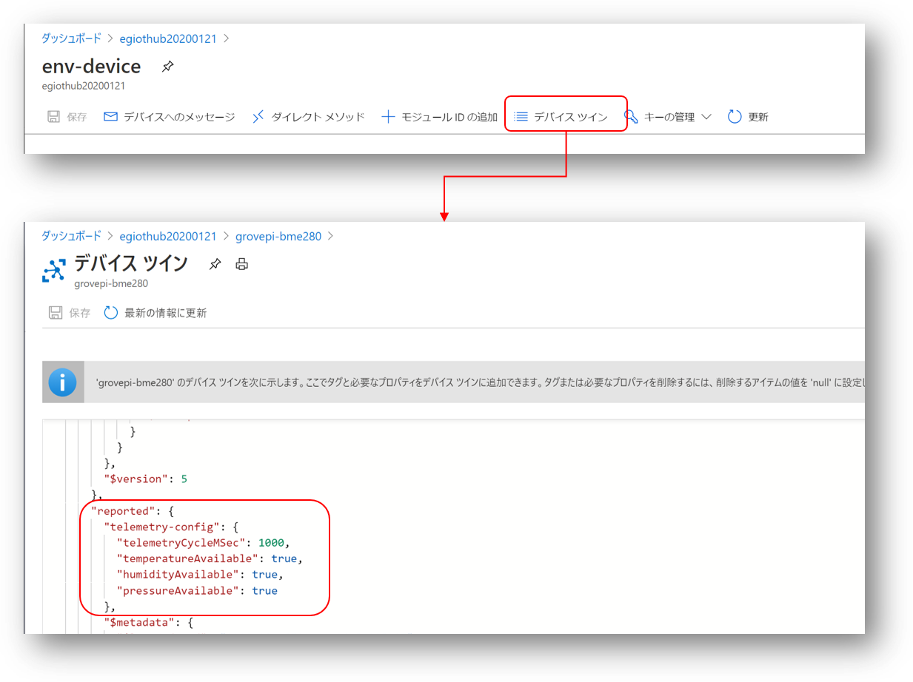
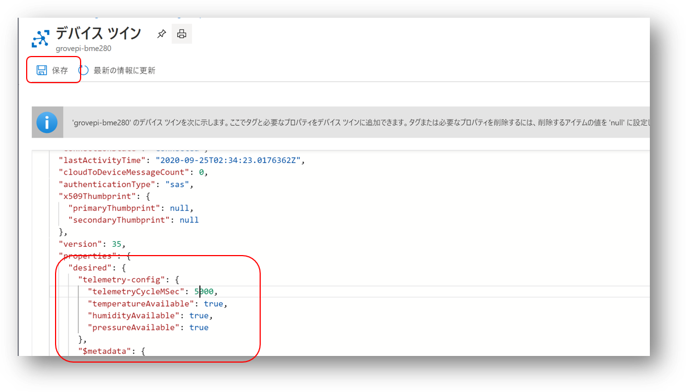
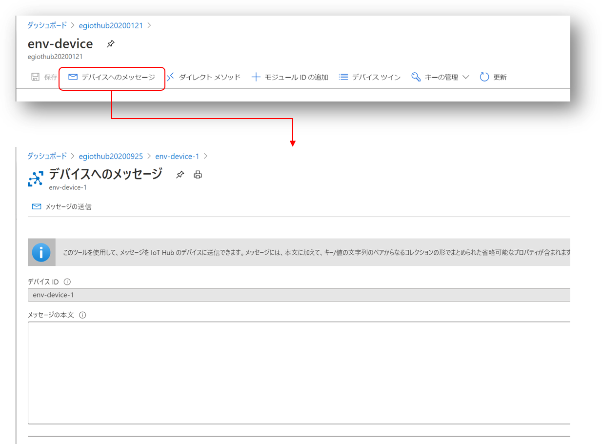
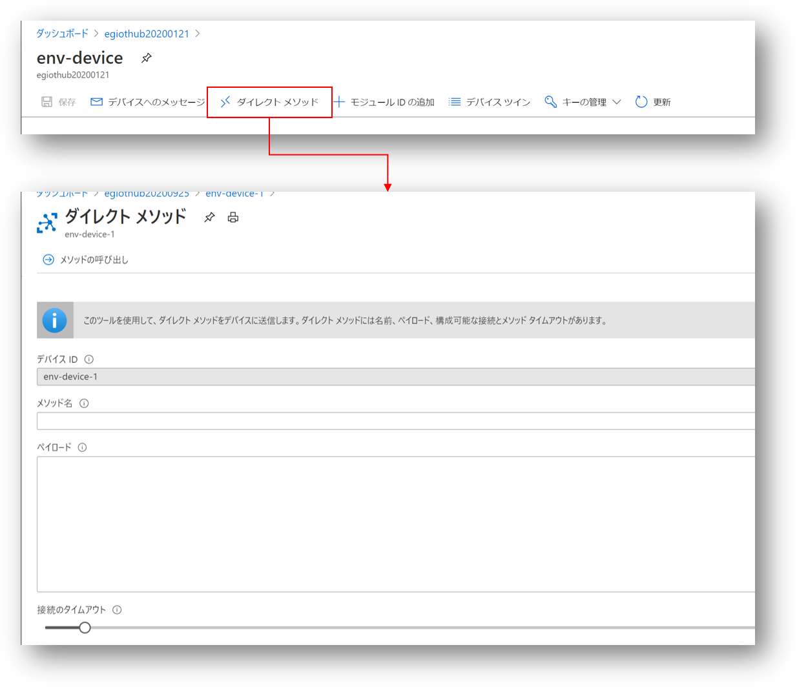

# Azure IoT Device SDK を使ったデバイスの接続  
このステップでは、Azure IoT Device SDK for .NET を使って、デバイスを Azure IoT Hub に接続する。 



## 実習内容
1. [IoT Hub への IoT デバイス登録](#1-iot-hub-への-iot-デバイス登録) 
2. [IoTAppDevSDK アプリの実行](#2-iotappdevsdk-アプリの実行)
3. [テレメトリーデータの確認](#3-テレメトリーデータの確認) 
4. [デバイスの設定情報更新](#4-デバイスの設定情報更新) 
5. [デバイスへのコマンド送信](#5-デバイスへのコマンド送信) 
6. [ダイレクトメソッドコール](#6-ダイレクトメソッドコール) 
---
## 1. IoT Hub への IoT デバイス登録  
Azure ポータルで、IoT デバイスを登録する。 
Azure ポータルで、作成した IoT Hub を開き、図のように登録したいデバイスの名前（デバイスID）を登録する。  
 
図では、"<i>env-device</i>" という名前で登録している。  
登録が完了すると、リストに表示されるので、登録したデバイス名をクリックすると以下の様な画面が表示される。  

赤枠をマウスでクリックすると、クリップボードに登録デバイス用の接続文字列（登録したデバイス用の秘密情報）がコピーされる。この文字列は次のステップで使うので、コピーしておくこと。 

--- 
## 2. IoTAppDevSDK アプリの実行 
Raspberry Pi に SSH で接続した Putty のシェル上で、[device/iotappdevsdk.tar.gz](../device/iotappdevsdk.tar.gz) をダウンロードし、解凍する。  
```
$ curl -OL https://github.com/ms-iotkithol-jp/environment-sensing-hands-on/blob/master/device/iotappdevsdk.tar.gz
$  tar zxvf iotappdevsdk.tar.gz
$ cd IoTAppDevSDK
```
[Program.cs](../device/IoTAppDevSDK/Program.cs) の一行目をコメントアウトする。
```
$ vi Program.cs
```
  
```C#
// #define REMOTE_DEBUG

```

前ステップで取得した接続文字列を使って、アプリを実行する。 
```
$ dotnet run 'connection string for device'
```
''で囲まれた、<i>connection string for device</i> の部分を接続文字列で置き換える。接続文字列の前後の ' は、忘れずにつけること。  

※ 本アプリは、Windows PC 上の[Visual Studio 2019](https://docs.microsoft.com/ja-jp/visualstudio/debugger/remote-debugging-dotnet-core-linux-with-ssh?view=vs-2019#attach-the-debugger)、または、[VS Code](https://www.jenx.si/2020/06/19/dot-net-core-remote-debugging-raspberry-pi/) からリモートデバッグが可能である。リモートデバッグでの実行確認を行いたい場合は、Program.cs の1行目のマクロをそのままにすると、リモートからのデバッガーのアタッチを待つループが実行されるようになるので、そこでブレークすればよい。


--- 
## 3. テレメトリーデータの確認 
アプリが実行されると、BME280センサーで計測した、温度、湿度、大気圧が、計測時間付きで1秒おきに送信される。  
正しく、送信されているかどうかを、[Azure IoT Explorer](https://docs.microsoft.com/ja-jp/azure/iot-pnp/howto-use-iot-explorer) を使って確認する。  
[リリースサイト](https://github.com/Azure/azure-iot-explorer/releases)から、最新の拡張子が、msi のファイルをダウンロード、実行し、インストールする。 
インストール完了後、Azure IoT Explorer を起動する。 
モニターには、Azure IoT Hub への接続が必要になるので、Azure Portal 上から、Azure IoT Hub に接続するための接続文字列を取得する。 

共有アクセスポリシーを選択し、<b>iothubowner</b> を選択して、表示された接続文字列をコピペする。  
※ iothubowner は、サービス側のエンドポイント、デバイス情報の登録参照が可能なロールである。  
Azure IoT Explorer を起動し、図の 'IoT Hub Connection String' に接続文字列をペーストし、"Connect"をクリックする。

接続が完了すると、登録されたデバイスの一覧が表示されるので、モニタリングしたいデバイスを選択し、 

Telemetryを選択して、'▷ Start' をクリックすると、Azure IoT Hub に送信されたテレメトリーデータが表示される。  
```
5:10:05 PM, September 25, 2020:
{
  "body": {
    "timestamp": "2020/09/25T08:10:04",
    "temperature": 26.8,
    "humidity": 65.78,
    "pressure": 99422.73
  },
  "enqueuedTime": "2020-09-25T08:10:05.010Z",
  "properties": {
    "data-type": "environment-sensing"
  }
}
```
このように、IoTAppDevSDK アプリが、IoT Hub に送信しているデータは、
```
{
    "timestamp": "2020/09/25T08:10:04",
    "temperature": 26.8,
    "humidity": 65.78,
    "pressure": 99422.73
}
```
の様な形式でJSONフォーマットで定期的に送信される。

--- 
## 4. デバイスの設定情報更新 
IoTAppDevSDK は、デフォルトで1秒間隔でテレメトリーデータを送信するが、送信間隔と、送信するセンサー種別を、サービス側から遠隔で Azure IoT Hub を通じて変更が可能である。 
Azure ポータルで、Azure IoT Hub の項目を開き、登録された IoT デバイスを表示する。  
※ 表示方法は、デバイス登録時に接続文字列を取得した際の手順と同じです。  
メニューから 'デバイスツイン' を選択すると、  

と、現在のテレメトリー設定が表示される。これは、IoTAppDevSDK アプリが起動時に現在の設定を更新しているものである。  
この、"telemetry-config":{...}の部分をコピーし、disired 要素に貼り付ける。  

telemetryCycleMSec (送信間隔-ミリ秒)を 5000 に変更して、保存をクリックすると、変更が IoTAppDevSDK に通知され、送信間隔が5秒おきに代わる事を、 Azure IoT Explorer で確認する。  

※ IoTAppDevSDK アプリは起動時に Desired のデジタルツインを参照するので、電源OFF時に設定が更新されても、設定情報を確実に反映させられる。  

※ Device Twin の更新は、Azure IoT Explorer でも可能である。

--- 
## 5. デバイスへのコマンド送信 
IoTAppDevSDK アプリは、Azure IoT Hub からコマンドを受信して、LED の点灯消灯を制御できる。 
デバイスツインを選択した同じページで、"デバイスへのメッセージ" を選択する。

"メッセージの本文"に、以下のJSON文字列を記入し、"メッセージの送信" をクリックすると LED が点灯する。
```
{"command":{"alert":"on"}}
```
'on' の部分を' off' に変えて送信すると、LEDが消灯する。 
```
{"command":{"alert":"of"}}
```
実際にやってみて確認すること。  

--- 
## 6. ダイレクトメソッドコール 
サービス側から、Azure IoT Hub を通じて、デバイスにコマンドを送信し、デバイス側で処理が完了した時点で（または途中で）サービス側に情報を返すような、同期的通信を ダイレクトメソッドという機構で行うことが可能である。  
デバイスツインを選択した同じページで、"ダイレクトメソッド"を選択する。

'メソッド名'と'ペイロード'に適切な文字列を記載し、'メソッドの呼び出し'をクリックすると、IoTAppDevSDK アプリ側で要求を受信し、対応する処理を実行して結果を返す。  
IoTAppDevSDK アプリでは、三つの Direct Method が用意されている。  

<b>StartTelemetry</b>  
ペイロード無し
このメソッドをコールすると、テレメトリーを開始する。  

<b>StopTelemetry</b>  
ペイロード無し
このメソッドをコールすると、テレメトリーを停止する。  

<b>Alert</b>  
ペイロード
```
{"value":"on"}
```
このメソッドをコールすると、LED が点灯する。'on' を 'off' に変えると、LEDが消灯する。 

StartTelemetry と StopTelemetry が実行されると、デバイスツインの Reported がそれに対応して更新される。  

それぞれ実際に試してみること。

---

以上で、実習は終了。 


--- 
## IoTAppDevSDK の各機能に対応するロジック  
自習した各機能は、[EnvironmentSensingDeviceClient.cs](../device/IoTAppDevSDK/EG/IoT/EnvironmentSensing/EnvironmentSensingDeviceClient.cs) で実装されている。具体的にどのような実装になっているか確認されたい。  
- テレメトリー送信 - private async Task SendTelemetryMessages(CancellationToken cs)
- デバイスツイン更新(Desired) - private async Task desiredPropertyUpdateCallbackMethod(TwinCollection desiredProperties, object userContext)
- デバイスツイン更新(Reported) - private async Task UpdateConfigToReportedProperties()
- C2D コマンド受信 - private async Task<MessageResponse> receivedMessageCallback(Message message, object userContext)
- ダイレクトメソッド - private async Task<MethodResponse> methodHandlerMethod(MethodRequest methodRequest, object userContext)

※ このハンズオンでは、、[EnvironmentSensingDeviceClient.cs](../device/IoTAppDevSDK/EG/IoT/EnvironmentSensing/EnvironmentSensingDeviceClient.cs) は、Azure IoT Device SDK によるアプリだけでなく、Azure IoT Edge Module でも同じファイルが使えるよう工夫されている。

---
[次のステップへ進む](IoTEdgeModule.md)