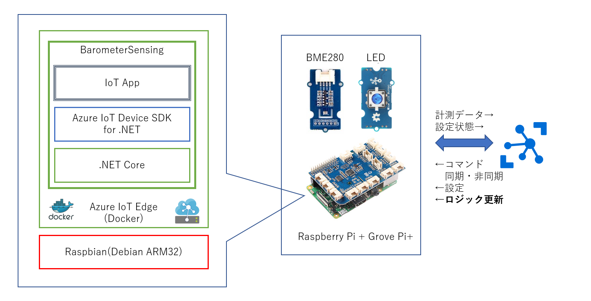
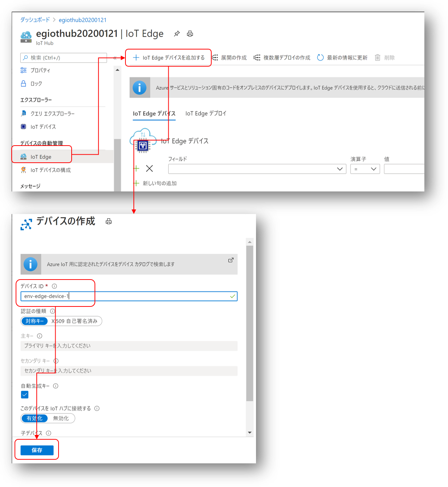
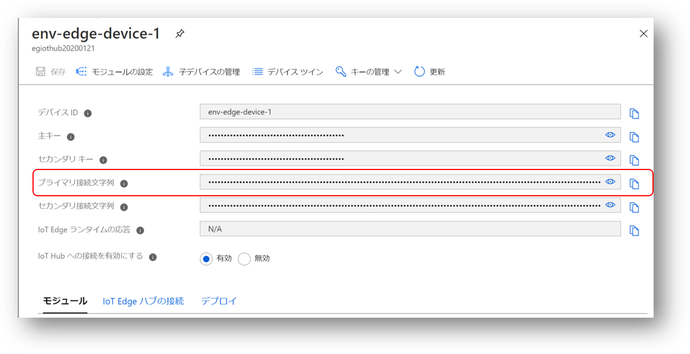
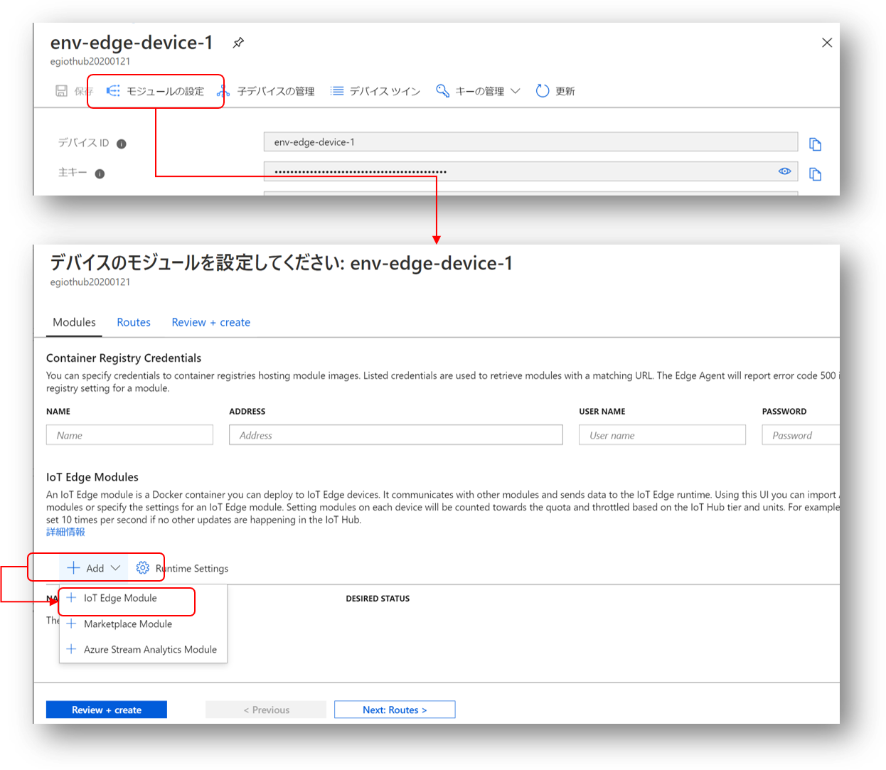
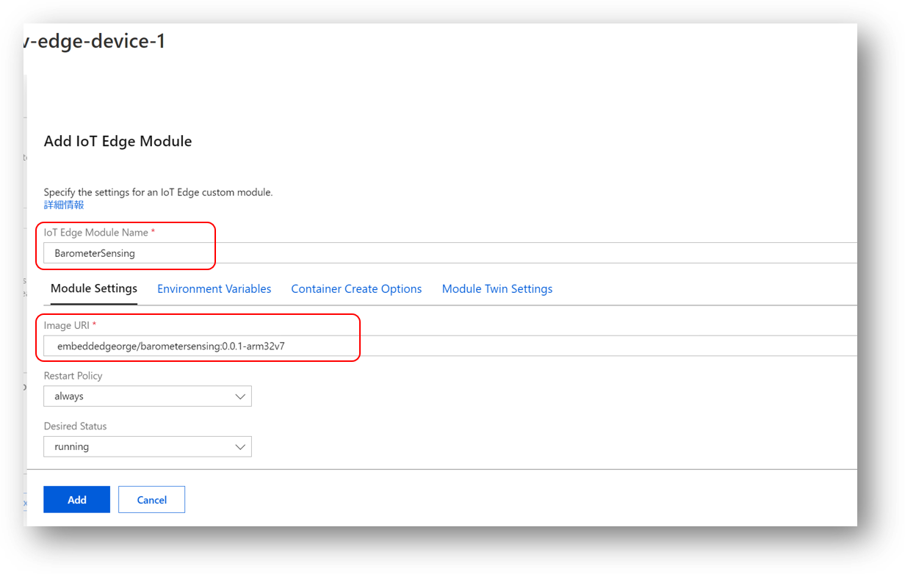
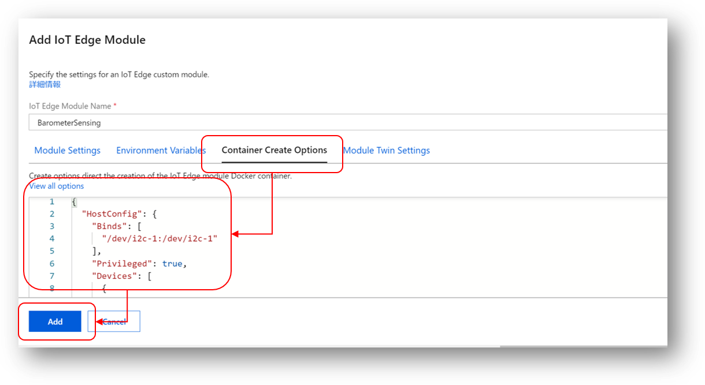
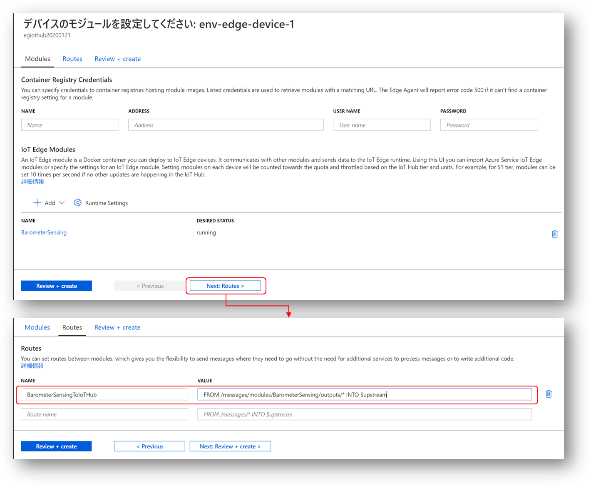
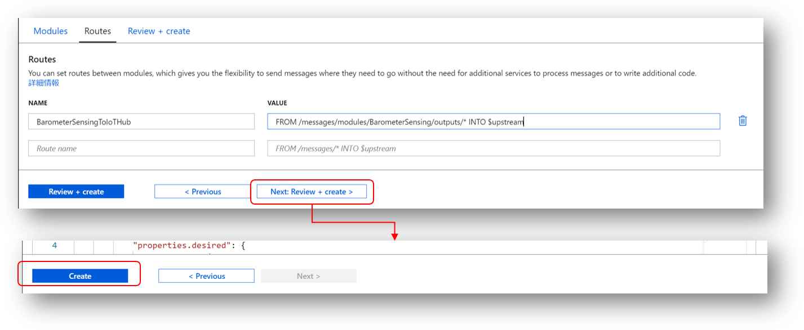
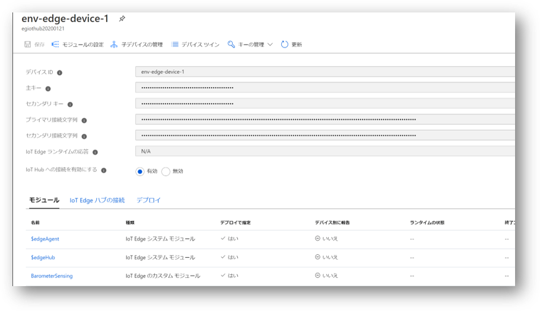
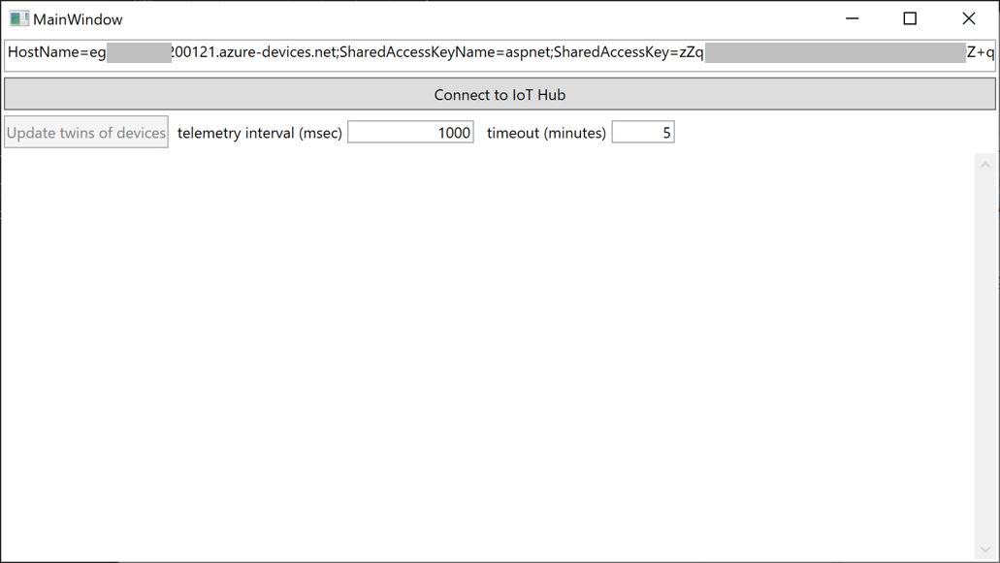

# Azure IoT Edge を使ったデバイスの接続  
このステップでは、Azure IoT Edge を使って、デバイスを Azure IoT Hub に接続する。 

 

利用者の利便性を考え、簡易版と中級版を提供する。適宜選択して実習すること。  
簡易版、詳細版、いずれも、計測、テレメトリーデータ送信、設定情報更新等のモジュール本体は、[BarometerSensing モジュール](../EdgeSolution/modules/BarometerSensing) を使用する。

- [IoT Edge デバイスの登録と Raspberry Pi の設定更新](#iot-edge-デバイスの登録と-raspberry-pi-の設定更新)
- [簡易版](#簡易版)
- [中級版](#中級版)

BarometerSensing モジュールの実行を確認したら、"[複数デバイスの一括制御](#複数デバイスの一括制御)"を実習の事。


---
## IoT Edge デバイスの登録と Raspberry Pi の設定更新 
簡易版、中級版共に、まずは、Azure IoT Hub に IoT Edge デバイスの登録と、Raspberry Pi 上で動作する IoT Edge Runtime の設定を行う。

### IoT Edge デバイスの登録  
Azure ポータルで、'IoT Edge'を選択し、'+IoT Edge デバイスを追加する'をクリックし、IoT Edge名を入力して登録する。

IoT Edge 名は任意であるが、ここでは便宜上、'<i>env-edge-device-1</i>'とする。  
登録が完了したら、一覧に表示されるので、登録した IoT Edge デバイスをリスト上で選択する。  

Azure IoT Device SDK を使用したデバイス接続の時と同様に、ここで表示された接続文字列を、IoT Edge 利用時の接続文字列として使用する。

## Raspberry Pi 上の設定更新 IoT Edge Runtime
前ステップで取得した接続文字列を使って、Raspberry Pi 上の、IoT Edge Runtime の設定を更新する。  
Raspberry Pi 上の Shell で、以下を実行し、設定ファイルを編集する。
```
$ sudo vi /etc/iotedge/config.yml
```
config.yml の以下のパート、
```yaml
# Manual provisioning configuration
provisioning:
  source: "manual"
  device_connection_string: "<ADD DEVICE CONNECTION STRING HERE>"
```
の、<i>\<ADD DEVICE CONNECTION STRING HERE\></i>を、登録した IoT Edge デバイスの接続文字列に置き換える。  
編集が終わったら、ESCキーをクリックし、"wq!" と入力し、保存する。  
config.yml の更新が完了後に、以下のコマンドを Shell 上で実行する。  
```
$ sudo systemctl restart iotedge
```
このコマンド実行により、IoT Edge Runtime が新しい設定で起動され、Azure IoT Hub に接続され、データの送受信やロジック構成更新が可能になる。 

以上で、準備が完了する。  

---
## 簡易版 
Azure ポータルを利用して、Docker Hub で公開された BarometerSensing を IoT Edge デバイスに配置する。 

1. BarometerSensing モジュールの登録
2. モジュール配置の確認

### BarometerSeinsing モジュールの登録
接続文字列を取得したページを開き、'モジュールの設定'をクリックする。  
'+Add' をクリックして、'+ IoT Edge Module' を選択する。
  
Edge Runtime 上に配置する際のモジュール名と、Azure IoT Edge Module Image の URI を入力する。  


- 'IoT Edge Module Name' → <b>BarometerSensing</b>  
- 'Image URI' → <b>embeddedgeorge/barometersensing:0.0.1-arm32v7</b>  

次に、'Container Create Options' を選択し、

`Value all options' に、以下のJSON分を転記し、
```JSON
{
  "HostConfig": {
    "Binds": [
      "/dev/i2c-1:/dev/i2c-1"
    ],
    "Privileged": true,
    "Devices": [
      {
        "PathOnHost": "/dev/i2c-1",
        "PathInContainer": "/dev/i2c-1",
        "CgroupPermissions": "mrw"
      }
    ]
  }
}
```
'Add' をクリックする。 
※ IoT Edge Module は、Docker Container である。上の設定は、マイクロサービス（一種の仮想環境）である Docker Container 内から BME280 センサー（I2Cデバイス） にアクセスするための設定である。  
この設定で、IoT Edge デバイスへの一つの IoT Edge Module の配置指定が完了する。  
次に、追加した、 BarometerSensing モジュールのテレメトリー情報を Azure IoT Hub に送信するための、メッセージルートを定義する。'Next Routes >' をクリックし、ルートの名前と、定義を入力する。  

- 'NAME' → <b>BarometerSensingToIoTHub</B>
- 'VALUE' → <b>FROM /messages/modules/BarometerSensing/outputs/* INTO $upstream</b>  

入力が終わったら、'Next Review + create >' をクリックし、更に、'create' をクリックして、IoT Edge Modules の配置設定を完了する。  

以上のステップを完了すると、IoT Edge デバイスの表示に BarometerSensing モジュールが表示される。

Raspberry Pi 上の IoT Edge Runtime に通知が行き、IoTEdge Runtime が指定の Uri から Docker Image を Pull して配置し、BarometerSensing モジュールの実行が開始され、IoT Hub に定期的にテレメトリー情報が送信される。  

---
### モジュール配置の確認 
Raspberry Pi の Shell 上で、以下のコマンドを実行し、配置したモジュールが表示されるか確認する。  
```
$ sudo iotedge list
```
BarometerSensing、edgeAgent、edgeHub の3つのモジュールが running 状態であること。  

※ 本コンテンツで、Azure IoT Edge Runtime は、この、edgeAgent と edgeHub の二つのモジュールで構成されている。

IoT Device App の実習で紹介した、Azure IoT Explorer を使って、メッセージが Azure IoT Hub に送信されているか確認する。  

BarometerSensing モジュールの実行ログは以下のコマンドで確認できる。
```
$ sudo iotedge logs BarometerSensing
```
正常に動いていれば、環境データの送信がログ表示される。  


IoT Device App の実習で紹介した、デバイスツイン（IoT Edge Module の場合は、モジュールツイン)、サービス側からのメッセージ受信、ダイレクトメソッドのコールが、BarometerSensing モジュールには実装されている。「[Microsoft Docs の関連ページ](https://docs.microsoft.com/ja-jp/azure/iot-edge/iot-edge-modules)」を参照して、それぞれの機能を試していただきたい。  


---
## 中級版  
BarometerSensing は、「[チュートリアル:Linux デバイス用の C# IoT Edge モジュールを開発する](https://docs.microsoft.com/ja-jp/azure/iot-edge/tutorial-csharp-module)」 をベースに作成したモジュールを改造したものである。子のチュートリアルに従って、VS Code で、IoT Edge Solution を作成し、[device/EdgeSolution](../device/EdgeSolution)の中身と見比べて、どこが違うか確認し、チュートリアルに従って作成した、Edge Solution を改造し、このハンズオンで公開されているファイル群を使って、同じものを作成してみよう。  
ただし、Raspberry Pi 用の ARM32V7 用のモジュールの Build は、Windows PC 上ではできないので、[device/EdgeSolution/modules/BarometerSensing](../device/EdgeSolution/modules/BarometerSensig)の中身を、Raspberry Pi 上に転送し、Docker build、Docker tag、Docker push を使って、ビルドとタグ付けと、ACR へのプッシュを行う必要がある。このような状況は、実際の IoT ソリューション開発では日常的なことなので、各自調べてスキルアップを図ってほしい。  


---
## 複数デバイスの一括制御  
Azure IoT Device SDK を使ったアプリケーションで実習した'<b>デバイスツイン</b>'は、Azure IoT Edge でも利用可能である。Azure IoT Edge の場合は、IoT Edge Runtimeが動いているデバイス向けのツインと、各モジュールごとのツインが用意されている。モジュールのツインのことを、'<b>モジュールツイン</b>'と呼ぶ。  
Azure IoT Device SDK を使ったアプリケーションの時と同様、モジュールツインも同様な方法で、Desired Properties を更新可能である。  
Azure IoT Device SDK を使った実習では、一つのデバイスのデバイスツイン呑みを更新していたが、ここでは、複数デバイスのツインを一括で更新する方法を実習する。  

※ 実際の IoT ソリューションでは、接続デバイスが増えていった場合に、更新が必要な膨大な数のデバイスを、一個づつ確実に更新していくのは、とても大変である。 Azure IoT Hub では、条件に合致する、デバイス、モジュールに対し、ツイン更新や Direct Methodコールを一括で行える機能を提供している。  

### 実習 
VS Code で、[services/ManageEdgeApp](../services/ManageEdgeApp) を開く。  
[MainWindow.xaml.cs](../services/ManageEdgeApp/MainWindow.xaml.cs) を開いて、30行目付近の、
```C#
        public MainWindow()
        {
            InitializeComponent();
            this.Loaded += MainWindow_Loaded;
        }

        string iothubConnectionString = "<- your IoT Hub service role onnection string ->";
        JobClient jobClient;

```
<b>\<- your IoT Hub service role onnection string -\></b> の部分を、各自の Azure IoT Hub の service ロールの接続文字列で置き換える。  
F5キーを押下して実行すると、以下の様な GUI が表示される。  
  
'<b>Connect to IoT Hub</b>' をクリックすると、このアプリケーションが Azure IoT Hub に、service ロールで接続される。  
'<b>telemetry interval(msec)</b>' に、単位をミリ秒で更新したいテレメトリーサイクル間隔を入力して、'<b>Update tiwns of devices</b> をクリックすると、条件に合致するデバイスのモジュールツインの更新がスケジュールされ、適宜更新されていく。  
更新状況は、テキストボックスやボタンの下のエリアにログ表示される。  

モジュールツインの一括更新は、以下の様なロジックで行われる。
```C#
  var twin = new Twin();
  var telemetryCycleSpec = new {
    telemetryCycleMSec = newIntervalMSec
  };
  twin.Properties.Desired["telemetry-config"] = telemetryCycleSpec;

  var jobId = System.Guid.NewGuid().ToString();
  var jobResponse = await jobClient.ScheduleTwinUpdateAsync(
    jobId,
    $"FROM devices.modules Where properties.reported.telemetry-config.telemetryCycleMSec <> {newIntervalMSec}",
    twin,
    DateTime.UtcNow,
    (long)TimeSpan.FromMinutes(newTimeoutMin).TotalSeconds);
```
モジュールツインが更新される条件は、 
```C#
$"FROM devices.modules Where properties.reported.telemetry-config.telemetryCycleMSec <> {newIntervalMSec}"
```
で、定義されている。モジュールツインの Reported Properties に、telemetry-config.telemetryCycleMSec というプロパティが定義されていて、かつ、新しく指定された、時間間隔と異なる値が指定されているものが自動的に選択されて、更新対象となる。 
Azure IoT Device SDK を使ったアプリデバイスの場合は、 
```C#
$"FROM devices Where properties.reported.telemetry-config.telemetryCycleMSec <> {newIntervalMSec}"
``` 
で指定すればよい。  

※ Direct Method コールの場合は、[https://github.com/ms-iotkithol-jp/AzureIoTHubDeviceMethodSampe/tree/master/utility/DirectMethodInJob](https://github.com/ms-iotkithol-jp/AzureIoTHubDeviceMethodSampe/tree/master/utility/DirectMethodInJob) にサンプルがあるので、そちらを参照の事。  

ただ一つのデバイスにせよ、複数デバイスの場合にせよ、ツインの更新や Direct Method コールの完了には、現実としてある程度時間がかかる。  
スケジュールされたジョブの状態を確認するコードが、[MainWindow.xaml.cs](../services/ManageEdgeApp/MainWindow.xaml.cs) に入っているので、動作を追ってほしい。
```C#
  private async Task MonitorJobStatus(string jobId, int timeoutMin)
  {
    var limitTime = DateTime.Now.AddMinutes(timeoutMin);
    do {
      var job = await jobClient.GetJobAsync(jobId);

      ShowLog($"JobId[{jobId} Status : {job.Status.ToString()}", true, this.Dispatcher);
      if (job.DeviceJobStatistics != null) {
        ShowLog($"Statistics - DeviceCount:   {job.DeviceJobStatistics.DeviceCount}", false, this.Dispatcher);
        ShowLog($"Statistics - FailedCount:   {job.DeviceJobStatistics.FailedCount}", false, this.Dispatcher);
        ShowLog($"Statistics - PendingCount:  {job.DeviceJobStatistics.PendingCount}", false, this.Dispatcher);
        ShowLog($"Statistics - RunningCount:  {job.DeviceJobStatistics.RunningCount}", false, this.Dispatcher);
        ShowLog($"Statistics - SucceededCount:{job.DeviceJobStatistics.SucceededCount}", false, this.Dispatcher);
      }
      if (job.Status == JobStatus.Cancelled || job.Status == JobStatus.Completed || job.Status == JobStatus.Failed) {
        switch (job.Status) {
        case JobStatus.Cancelled:
          ShowLog("Job has been canceled", true, this.Dispatcher);
          break;
        case JobStatus.Completed:
          ShowLog("Job has been completed", true, this.Dispatcher);
          break;
        case JobStatus.Failed:
          ShowLog("Job has been failed", true, this.Dispatcher);
          break;
        }
        break;
      }
    }
    await Task.Delay(1000);
  } while (DateTime.Now < limitTime);

  ShowLog($"Job[{jobId}] is finished.", true, this.Dispatcher);
```

---
## おまけ  
実習は、ローカルネットに開発用PC と Raspberry Pi を接続して、SSH 接続で行っているが、Raspberry Pi は DHCP 接続のため、IP アドレスが接続の度に代わる場合があり、その都度、ディスプレイやマウスを Raspberry Pi に接続して確認が必要となる。これは非常に煩雑であるので、接続時に Raspberry Pi のローカルネットの IP アドレスを Reported Properties で通知するモジュールを追加する。  
「[簡易版](#簡易版)」で学んだ方法で、以下のモジュールを追加する。 
- モジュール名 '<b>gethostipaddress</b>'
- Image Uri  '<b>embeddedgeorge/gethostipaddresspython:0.0.1-arm32v7</b>
- Create Option
```json
{
  "HostConfig": {
    "NetworkMode": "host",
    "Privileged": true
  },
  "NetworkingConfig": {
    "EndpointsConfig": {
      "host": {}
    }
  }
}```
Raspberry Pi 起動時に確定した、IP アドレスが、追加したモジュールのツインの Reported Properties に表示される。 

--- 
[次のステップに進む](StreamAnalytics.md)