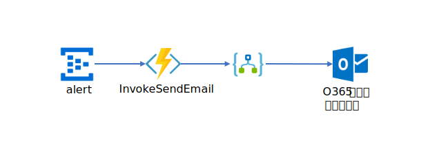
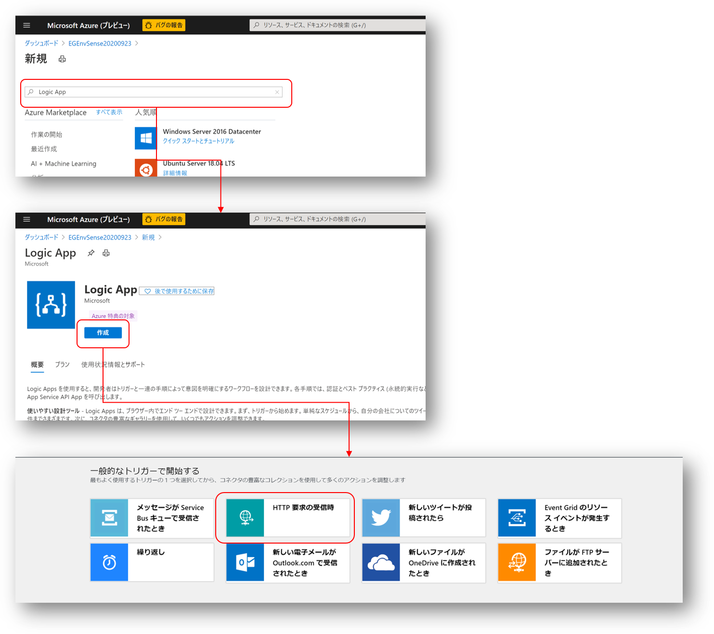
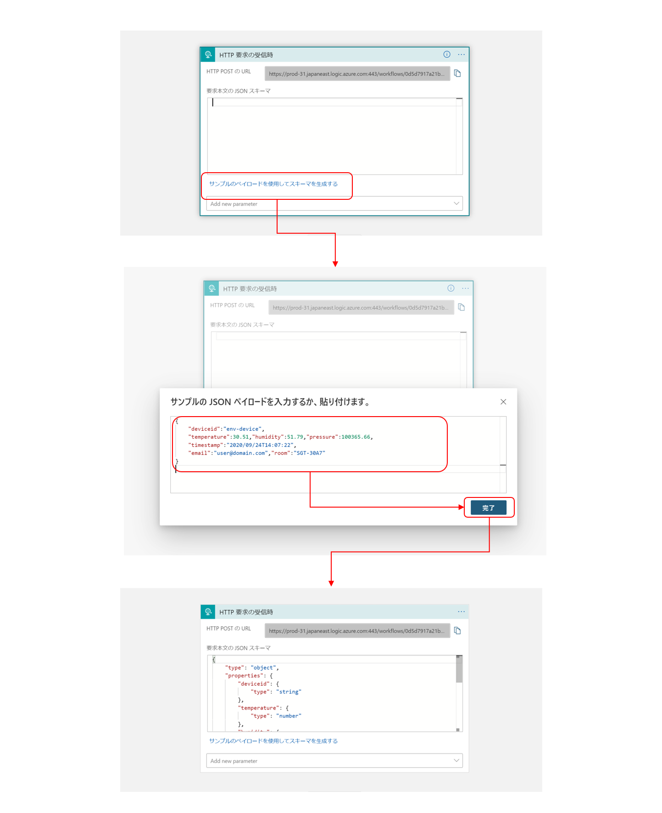
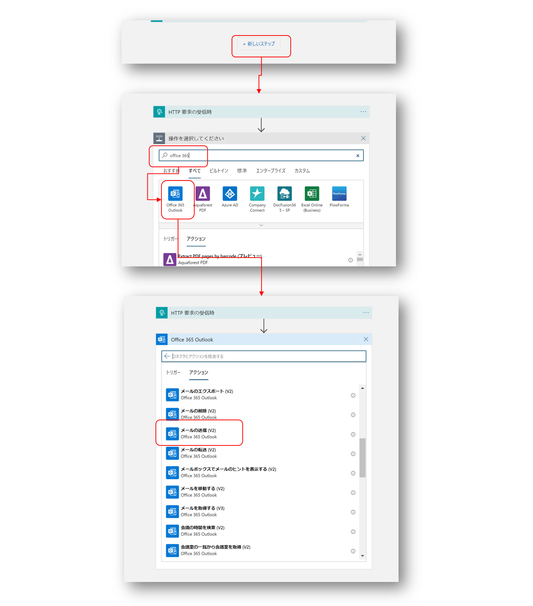
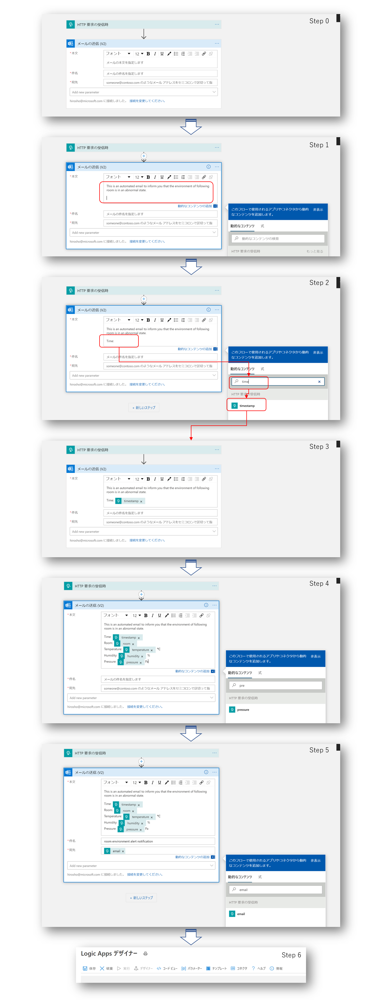
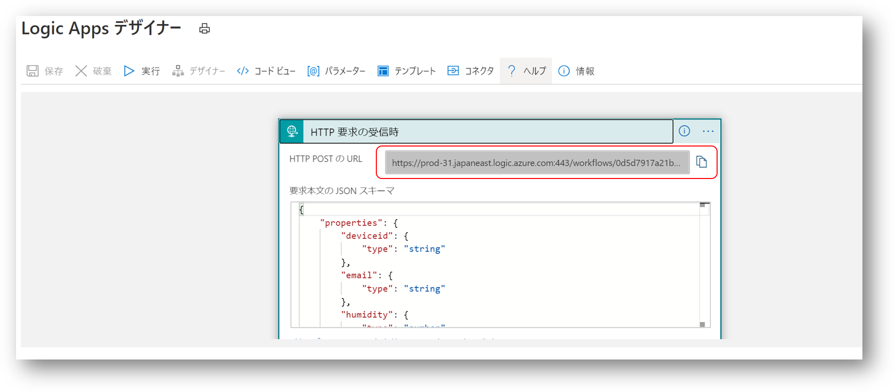

# 警告メールを送信する  
Stream Analytics で抽出した警告データをトリガーにメールを送信する方法を実習する。 Event Hub の <b>alert</b> で受信したデータを、Logic App サービスを使って、警告状態にあるデバイスの管理者にメールを送信する。  


※ 本実習を行うには、Office 365 のアカウントが必要  

以下の手順で実習を行う。  
1. [メールを送信する Logic App を作成](#メールを送信する-logic-app-を作成)  
2. [<b>alert</b> Event Hub へのメッセージ受信をトリガーに、Logic App を起動する Function を作成する](#alert-event-hub-へのメッセージ受信をトリガーにlogic-app-を起動する-function-を作成する)  

---
## メールを送信する Logic App を作成  
以下の図に従って、Logic App を作成する。

'HTTP要求の受信時'をトリガーとして作成する。  


<b>alert</b> Event Hub が受信するデータは、以下の形式である。  
```json
{
    "deviceid":"env-device",
    "temperature":30.51,"humidity":51.79,"pressure":100365.66,
    "timestamp":"2020/09/24T14:07:22",
    "email":"user@domain.com","room":"SGT-30A7"
}
```
これを'サンプルペイロード'として使って、'HTTP要求受信時'の設定を行う。  



'+新しいステップ'をクリックし、図に従ってメール送信を追加する。途中、Office 365 の認証が入るので、Office 365 アカウントでサインインすること。



図に従って、メールの本文、タイトル、あて先を設定していく。  

  

本文の冒頭は以下を使う。
```
This is an automated email to inform you that the environment of following room is in an abnormal state.
```
件名は、
```
room environment alert notification
```
を使う。

以上で、設定は完了。'保存'をクリックして、

'HTTP POST の URL'を取得する。右の紙が重なったようなアイコンをクリックすれば、文字列がクリップボードにコピーされる。この URL は次のステップで利用する。  

---
## <b>alert</b> Event Hub へのメッセージ受信をトリガーに、Logic App を起動する Function を作成する  
VS Code で、[services/SendEmailTrigger](../services/SendEmailTrigger) を開く。  
[local.settings.json](../services/SendEmailTrigger/local.settings.json) に、Event Hub への接続文字列、Logic App の HTTP POST URL を設定する。
```json
{
  "IsEncrypted": false,
  "Values": {
    "AzureWebJobsStorage": "<- your storage accont connection string ->",
    "FUNCTIONS_WORKER_RUNTIME": "dotnet",
    "source_EVENTHUB":"<- your event hub binded to Stream Analytics output connection string ->"
  }
  ,
  "ConnectionStrings":{
    "logic_app_HTTP_POST_URL":"<- your logic app uri ->"
  }
}
```
'<b>source_EVENTHUB</b>' は、<b>alert</b> Event Hub の、<b>listen</b> ポリシーの接続文字列を使用する。  
'<b>logic_app_HTTP_POST_URL</b>' に、前のステップの URL をセットする。

以上で設定は完了である。「[環境データの共有](DataShare.md#Azure-へのデプロイ)」で実習した方法で、ローカルテストと、Azure へのデプロイを行う。  

※ そのまま動かすと正しく動きません。[InvokeSendEmail.cs](../services/SendEmailTrigger/InvokeSendEmail.cs) を良ーく見て、間違いを直してください。  


以上で、このステップは実習完了である。

---
## ロジックの解説  
Event Hub で受信したデータを元に、Logic App を起動するロジックを抜粋する。  
```C#
    string messageBody = Encoding.UTF8.GetString(eventData.Body.Array, eventData.Body.Offset, eventData.Body.Count);

    // Replace these two lines with your processing logic.
    log.LogInformation($"C# Event Hub trigger function processed a message: {messageBody}");

    bool isSend = false;
    if (lastInvokedTime == null) {
        lastInvokedTime = DateTime.Now;
        isSend = true;
    }
    else {
        if (currentTime - lastInvokedTime > sendingInterval) {
            isSend = true;
            lastInvokedTime = currentTime;
        }
    }
    if (isSend) {
        dynamic envDataJson = Newtonsoft.Json.JsonConvert.DeserializeObject(messageBody);
        dynamic envData = envDataJson[0];
        string envDataMsg = Newtonsoft.Json.JsonConvert.SerializeObject(envData);
        var response = await httpClient.PostAsync(logicAppUri, new StringContent(envDataMsg, Encoding.UTF8, "application/json"));
        if (response.StatusCode == HttpStatusCode.OK || response.StatusCode == HttpStatusCode.Accepted) {
            log.LogInformation($"Logic App invocation is succeeded. - {response.StatusCode}");
        } else {
            log.LogInformation($"Logic App invocation is failed - {response.StatusCode}");
        }
    }
```
Logic App の起動は、HttpClient クラスを使っている。  
Stream Analytics は、30度を超えた温度を抽出して継続的に送ってくるので、複数のメールが一度に送信されないように工夫をいれている。

…と書いたが、実はこのロジックは実用のレベルを満たさない。グラフ表示を確認後、どこが問題なのか考察し、デバイスごとに温度が閾値を超えた時点でだけ確実にメールが送信されるよう改造すること。  

ヒント1：実際のシステムでは、複数のデバイスからデータが送られてくる。その場合に何が起こるか考えるとよい。  

ヒント2: Function だけで解決するのは多分無理。 「[Azure Stream Analytics での一般的なクエリ パターン](https://docs.microsoft.com/ja-jp/azure/stream-analytics/stream-analytics-stream-analytics-query-patterns#calculation-over-past-events)」を参考に Stream Analytics のクエリーを修正するとよい。


---
[次のステップへ](IoTCentral.md)
