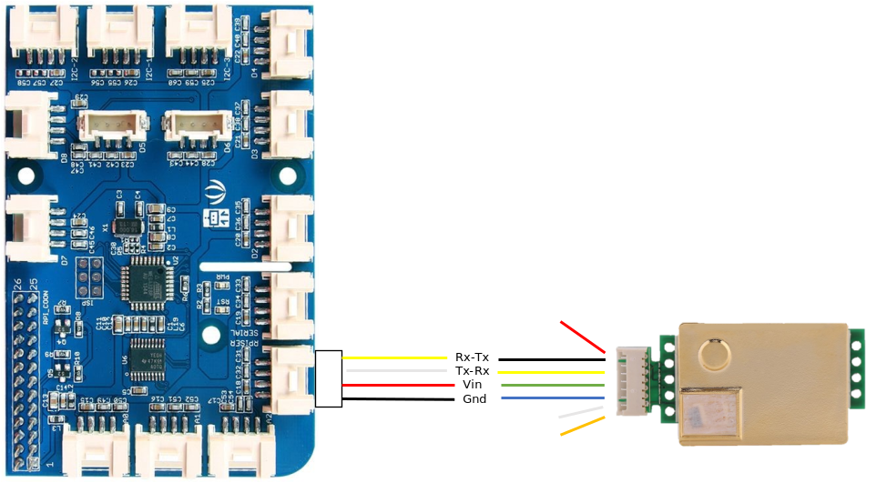

# デバイスのセットアップ  
本ハンズオンで使用する機材は以下のとおりである。 
- Raspberry Pi 3 または 4 
- [Groove Pi+](https://jp.seeedstudio.com/GrovePi-p-2241.html) 
- [Grove BME280 環境センサー](https://jp.seeedstudio.com/Grove-Temp-Humi-Barometer-Sensor-BME280-p-495.html)
- [Grove Blue LED Button](https://www.seeedstudio.com/Grove-Blue-LED-Button.html)  

他に、Raspberry Pi 用の 32GB 以上のuSDカードと 5V 電源を用意すること。 
LED Button は、別の色でも構わない。

---
## Raspberry Pi のセットアップ  
### OS のセットアップ
[Raspberry Piのサイト](https://projects.raspberrypi.org/en/pathways/getting-started-with-raspberry-pi) を参考に、Raspbian をインストールする。  
インストール完了後、Raspberry Pi のデスクトップのメニューで、  
Preference → Raspberry Pi Configuration  
で、設定画面を開き、Interfeces タブを選択して、接続を全て Enable にする。

### .NET Core のインストール  
[https://elbruno.com/2019/12/30/raspberypi-how-to-install-net-core-3-1-in-a-raspberry-pi-4/](https://elbruno.com/2019/12/30/raspberypi-how-to-install-net-core-3-1-in-a-raspberry-pi-4/) を参考に、.NET Core SDK をインストールする。 
.NET Core SDKは、Azure IoT Device SDK for .NET を使った IoT アプリをビルド、実行するために使用する。 

### Azure IoT Edge Runtime のインストール 
基本的な流れは、[https://docs.microsoft.com/ja-jp/azure/iot-edge/how-to-install-iot-edge-linux](https://docs.microsoft.com/ja-jp/azure/iot-edge/how-to-install-iot-edge-linux) を参照されたい。 ただし、2020/9/25時点で、正式対応されているのは、Stretch までなので、Raspbian Buster を使用する場合は、[Install Azure IoT Edge Runtime on Raspbian Buster](https://dev.to/azure/azure-iot-edge-on-raspberry-pi-buster-plus-tips-for-raspberry-pi-4-22nn#installing-azure-iot-edge-on-raspbian-buster) に従ってインストールするとよい。 

---
### ハンズオン用 SW の準備  
開発用PCで、以下のコマンドを実行して、このハンズオンのリポジトリをクローンし、SW を準備する。 
 ```
 $ git clone https://github.com/ms-iotkithol-jp/environment-sensing-hands-on.git
 ```

※ このハンズオンでは、Putty を使っての実習を想定している。

-----------
## Grove Pi+ の装着とセンサー類の接続  
Grove Pi+ は Raspberry Piのイーサーネット接続ポートを左上にした状態で、Grove Pi+ が、ピンがある角を、左下にぴったり合した形で装着する。 
- BME280 環境センサー → I2C-1
- LED Button → D4  

  

2021/06/21 に、時節柄 CO2センサーを追加した。CO2センサーは、比較的安く、入手が容易（？）な [MH-Z19B](https://www.winsen-sensor.com/d/files/MH-Z19B.pdf) を使う。  
MH-Z19B と GrovePi＋との接続は、Seeed の Grove センサー用のケーブルではそのまま接続できないので、図の様にそれぞれのケーブルを活用して接続する。  


※ CO2センサー計測ロジックありなしで、Balometer Sensing の Docker Image をそれぞれ以下の通り用意した。  
|type|docker image|
|-|-|
|CO2センサー無し|embeddedgeorge/barometersensing:1.0.0-arm32v7|
|CO2センサーあり|embeddedgeorge/barometersensing-co2:1.0.0-arm32v7|  

※ [device/EdgeSolution/BarometerSensoing/Program.cs](../device/EdgeSolution/BarometerSensoing/Program.cs) の2行目の"// "を削除して Docker Image をビルドすれば、CO2ありのモジュールが出来上がる    


---
[次のステップへ進む](IoTHub.md)
