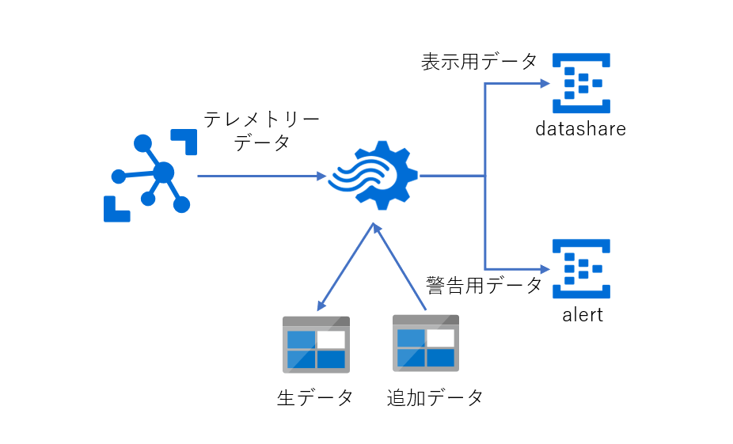
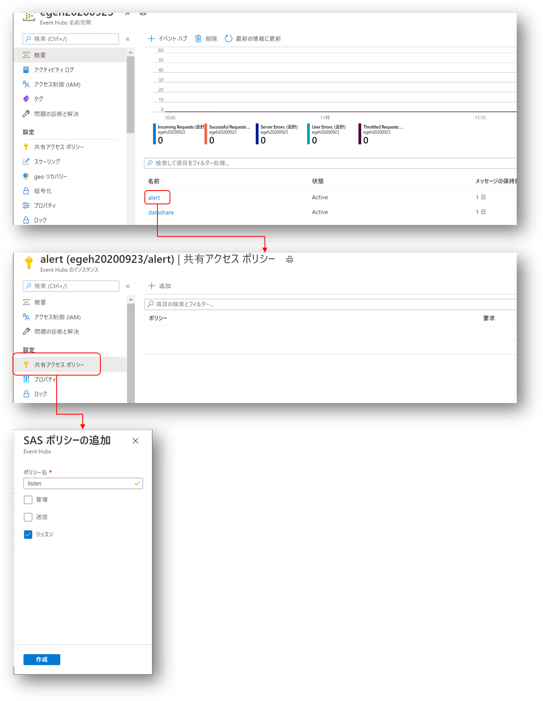
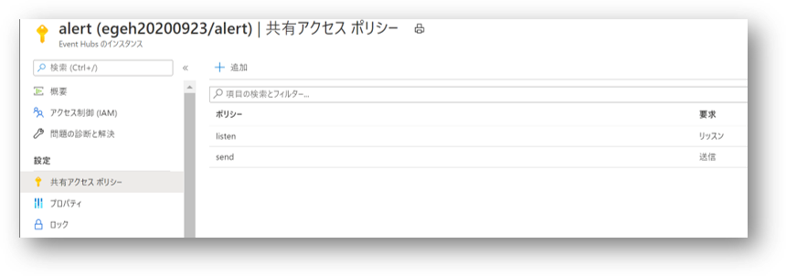
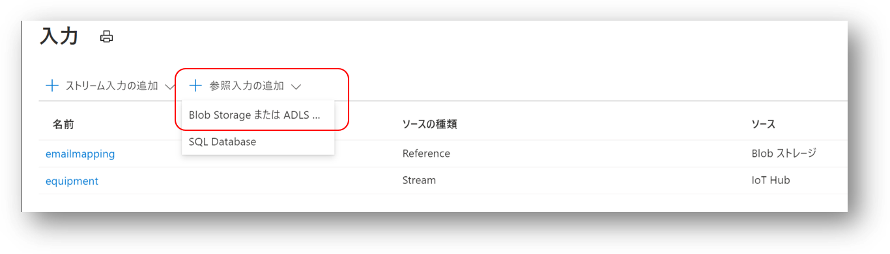
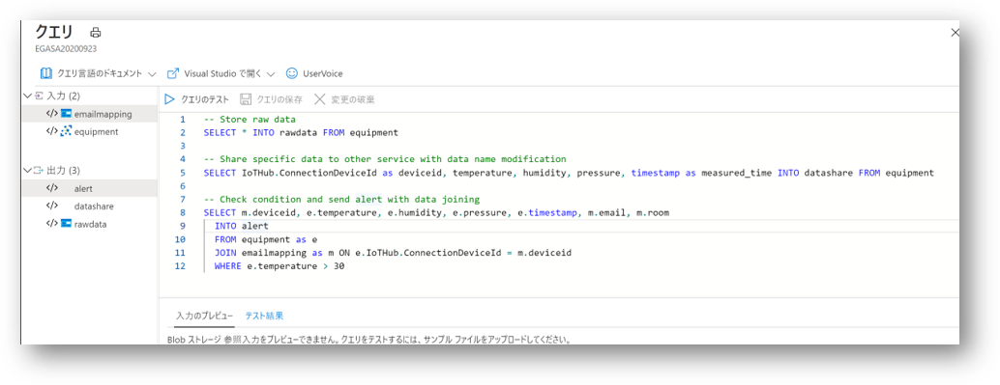

# Azure IoT Hub で受信したデータをリアルタイム処理する  
このステップでは、Azure Stream Analytics を使って、Azure IoT Hub がデバイスから受信したテレメトリーデータを、IoT Solution が実現したいシナリオに従ってデータ変換や、条件抽出を行う方法を学習する。  
作成するサービス群と接続は以下のとおりである。  


作成する Stream Aanlytics に含まれる機能は以下のとおり。  
- Azure IoT Hub が受信したデータを Blob Container に蓄積
- 後段のサービスが必要とする、デバイスに紐づいたデータ項目を追加
- 条件に合致するテレメトリーデータの抽出 

作業手順
1. [Blob Container の作成](#1-blob-container-の作成)
2. [Event Hub の作成](#2-event-hub-の作成)
3. [Stream Analytics の作成](#3-stream-analytics-の作成)
4. [入力の作成](#4-入力の作成) 
5. [出力の作成](#4-出力の作成) 
6. [クエリーの作成と Analytics の実行](#5-クエリーの作成と-stream-analytics-の実行) 

-------------------------------
## 1. Blob Container の作成  
このステップでは、Azure Storage Account を作成し、生データ格納用の Blob Container（JSONファイルが格納） と、追加データ（CSVファイルを格納）用の Blob Container を作成します。  
### Azure Storage Account の作成  
「[Azure Storage アカウントの作成](https://docs.microsoft.com/ja-jp/azure/storage/common/storage-account-create?tabs=azure-portal)」に従って、Azure Storage Account を作成する。名前は適宜で、リソースグループとリージョンは、作成している Azure IoT Hub を同じものを選択する。  
名前、リソースグループ、リージョン以外の設定はデフォルトのままでよい。  

### 生データ格納用の Blob Container 作成 
「[コンテナーを作成する](https://docs.microsoft.com/ja-jp/azure/storage/blobs/storage-quickstart-blobs-portal)」 に従って、Blob Container を'プライベート'で、作成した Storage Account に作成する。  
名前は、'<b>environment-rawdata</b>' とする。

### 追加データ格納用の Blob Container 作成 
同様に、Blob Container を'プライベート'で、作成した Storage Account に作成する。  
名前は、'<b>stream-analytics-reference</b>' とする。 
Windows PC 上で、以下の内容のCSVファイルを、'<b>device-email-map.csv</b>'という名前で作成する。 
```csv
deviceid,email,room
env-edge-device-1,user@domain.com,room-name
```
二行目の一番目の項目は、Azure IoT Hub に登録した IoT Edge デバイスの名前である。二番目の項目は、一番目の項目に記載した、IoT Edge デバイスの環境データが閾値を超えた時にメールを送信するためのメールアドレスである。実習者が実際に受信可能なメールアドレスを使うこと。三番目の項目は、Raspberry Pi ＋ Grove Pi+ ＋ BME280 が設置された部屋の名前を使う。これらの情報は、Stream Analytics の実行時に、デバイスから送信されたテレメトリーデータと紐づけられ、後段のサービスに送信される。  
CSVファイルが出来上がったら、作成した Blob Container にアップロードする。  
アップロード方法は、「[ブロック BLOB をアップロードする](https://docs.microsoft.com/ja-jp/azure/storage/blobs/storage-quickstart-blobs-portal#upload-a-block-blob)」を参照のこと。  


----
## 2. Event Hub の作成  
次に、Stream Analytics の処理結果を受信する Event Hub を二つ作成する。一つはテレメトリーデータをダッシュボード表示するためのデータの受け口で、もう一つは、決められた閾値を超えた時のデータの受け口である。  
「[クイック スタート:Azure portal を使用したイベント ハブの作成](https://docs.microsoft.com/ja-jp/azure/event-hubs/event-hubs-create)」を参考に、作成した Azure IoT Hub と同じリソースグループ、リージョンに、Event Hub 名前空間と
- <b>datashare</b>
- <b>alert</b>  

という名前の Event Hub を作成する。  
Stream Analytics が Event Hub にデータを送信するには、デバイスが Azure IoT Hub に接続するときに接続文字列が必要だったのと同様、送信用のロールとSAS Tokenを含む接続文字列が必要である。  
まず、'<b>alert</b>' に、この Event Hub からデータを受信するためのポリシーを、'<b>listen</b>' という名前で作成する方法を例示する。 

1. 設定したい Event Hub を選択 
2. '<b>共有アクセスポリシー</b>' を選択
3. '<b>＋追加</b>'をクリック 
4. '<b>listen</b>'という名前を入力
5. '<b>リッスン</b>'をチェック
6. '<b>作成</b>'をクリック 

この流れを参考に、'<b>送信</b>'という権限を持った、'<b>send</b>'というポリシーを作成する。作成されたポリシーは、リスト表示される。  

同様に、作成した、'<b>datashare</b>' にも、送信権限、受信権限を持った、'<b>send</b>'、'<b>listen</b>'という名前のポリシーを作成する。  

以上で、Stream Analytics が必要な入力と出力一式の準備が完了する。  

---
## 3. Stream Analytics の作成  
「[Azure Stream Analytics のジョブの作成](https://docs.microsoft.com/ja-jp/azure/stream-analytics/stream-analytics-quick-create-portal#create-a-stream-analytics-job)」 を参考に、Stream Analytics を作成する。リソースグループ、リージョンは、作成した Azure IoT Hub と同じものを使う事。名前は任意である。  

---
## 4. 入力の作成  
入力は、Azure IoT Hub からのストリーム入力と、追加データ用に作成した Blob からの参照入力の二つを作成する。  
### Azure IoT Hub をストリーム入力として追加する  

「[ジョブの入力を構成する](https://docs.microsoft.com/ja-jp/azure/stream-analytics/stream-analytics-quick-create-portal#configure-job-input)」を参考に、作成した Azure IoT Hub をストリーム入力として定義する。入力エイリアス、  

- <b>equipment</b>  

とすること。また、IoT Hub のコンシューマーグループは、  
- '<b>sa</b>'  

を選択すること。  
参照入力は、

のように、'<b>＋参照入力の追加</b>'で、'<b>Blob Storage または…</b>'
を選択し、指示に従って、<b>device-email-map.csv</b>を選択して、
- '<b>emailmapping</b>'  

という入力エイリアスで、作成する。 

※ 入力作成時、自動的に接続テストが行われる。エラーが表示された場合は、状況を調べて適宜対応し、正しく入力が作成されていることを確認すること。

---
## 4. 出力の作成  
出力は、生データ保存、環境データ共有用、条件抽出通知用の3つを作成する。  
生データ保存は、1.で作成した、'<b>rawdata</b>' という名前の Blob Container を指定する。「[ジョブの出力を構成する](https://docs.microsoft.com/ja-jp/azure/stream-analytics/stream-analytics-quick-create-portal#configure-job-output)」を参考に、  

- <b>rawdata</b>

という出力エイリアスで作成する。  

次に、環境データ共有用の出力を作成する。この出力は、2.で作成した、'<b>datashare</b>' という名前の Event Hub に接続する。Stream Analytics の出力定義で、イベントハブを選択すると、対象 Event Hub のリストが出てくるので、それに従って適切に選択していき、
- '<b>datashare</b>'

という名前の出力エイリアスで作成する。ポリシーは、'<b>send</b>' を選択すること。  

同様に、条件抽出通知用の出力も、
- '<b>alert</b>

という名前の出力エイリアスで、該当する Event Hub を選択して作成する。  


※ 出力作成時、自動的に接続テストが行われる。エラーが表示された場合は、状況を調べて適宜対応し、正しく出力が作成されていることを確認すること。


---
## 5. クエリーの作成と Stream Analytics の実行  

'クエリーの編集'をクリックして、以下のテキストを貼り付ける。
```sql
-- Store raw data
SELECT * INTO rawdata FROM equipment

-- Share specific data to other service with data name modification
SELECT IoTHub.ConnectionDeviceId as deviceid, temperature, humidity, pressure, timestamp as measured_time INTO datashare FROM equipment

-- Check condition and send alert with data joining
SELECT m.deviceid, e.temperature, e.humidity, e.pressure, e.timestamp, m.email, m.room
  INTO alert
  FROM equipment as e
  JOIN emailmapping as m ON e.IoTHub.ConnectionDeviceId = m.deviceid
  WHERE e.temperature > 30 
```
貼り付けたら、'クエリーの保存'をクリックして保存する。  
ここまで終わった状態を下図に示す。


入力が2つ、出力が3つ、など、正しく設定されているか今一度確認すること。  

確認が終わったら Stream Analytics の概要ページに戻り、'▷ 開始'をクリックし、実行を開始させる。  
IoT Edge デバイスからデータが送られていることを確認し、また、Stream Analytics ジョブの実行エラーが出ていないことを確認し、 1. で作成した、'<b>rawdata</b>' Blob Container を確認する。正常に動いていれば、JSONファイルが順次増えていく。  

以上で、本ステップは完了です。  

## クエリー解説  
クエリーは3つのパートで構成されている。  
```sql
-- Store raw data
SELECT * INTO rawdata FROM equipment
```
equipment(IoT Hubが受信したデータ)を、そのまま全て、rawdata(Blob Container)に出力する。最も基本的なクエリー

```sql
-- Share specific data to other service with data name modification
SELECT IoTHub.ConnectionDeviceId as deviceid, temperature, humidity, pressure, timestamp as measured_time INTO datashare FROM equipment
```
受信したデータのうち、一部だけを datashare(Event Hub)に出力している。また、データシェアをする後段のサービスは、計測時間を 'measured_time' という名前を想定しているので、それに合わせて変換している。


```sql
-- Check condition and send alert with data joining
SELECT m.deviceid, e.temperature, e.humidity, e.pressure, e.timestamp, m.email, m.room
  INTO alert
  FROM equipment as e
  JOIN emailmapping as m ON e.IoTHub.ConnectionDeviceId = m.deviceid
  WHERE e.temperature > 30 
```
emailmapping(device-email-map.csvが本体)と、IoT Hub から送付されたデータのdeviceidを紐づけて、そのデバイスの部屋情報と、その管理者のメールアドレスを紐づけている。更に、温度が30度を超えた場合のみ、alert（Event Hub）に出力を行っている。

## おまけ  
クエリーでは、四則演算やビルトイン関数を使ったデータ計算や、複数レコードにわたる集合処理等も可能である。  
JavaScript や C# を使ったユーザー定義関数を組み込むことができる。受信したデータの複雑な加工が必要な場合に便利である。  
3番目のクエリーは単なる数値比較でとてもシンプルであるが、「[Stream Analyticsでの異常検出](https://docs.microsoft.com/ja-jp/azure/stream-analytics/stream-analytics-machine-learning-anomaly-detection)」を使うと、異常トレンドの抽出など、より高度な異常検知が可能になる。また、この機能は、Azure IoT Edge 上でも動作可能である。  

以上を踏まえ、様々なシナリオに応じたクエリーを考えてみていただきたい。  

---
[次のステップへ進む](DataShare.md)